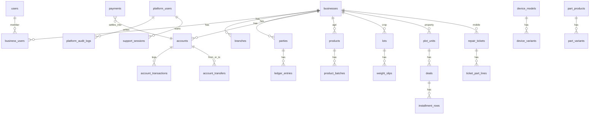

# 11 — Data Model, APIs & Appendices

[← Index](README.md) · [10 Risks & Vision](10-roadmap-risks-vision.md)

**Canonical reference** for PostgreSQL tables, relations, field requirements, and REST `/api/v1/` endpoints. Vertical behavior: [02](02-vertical-agri-inputs.md) · [03](03-vertical-crop-trading.md) · [04](04-vertical-property-plots.md) · [05](05-vertical-mobile-repair.md). Tenancy: [06](06-personas-and-workspace.md).

---

## Table of contents

1. [Conventions](#1-conventions)
2. [Entity relationship overview](#2-entity-relationship-overview)
3. [Platform & auth](#3-platform--auth)
4. [Workspace & team](#4-workspace--team)
5. [Parties, khata & attachments](#5-parties-khata--attachments)
6. [Accounts, billing, payments & cashflow](#6-accounts-billing-payments--cashflow)
7. [Inventory (shared patterns)](#7-inventory-shared-patterns)
8. [Agri vertical](#8-agri-vertical)
9. [Crop vertical](#9-crop-vertical)
10. [Property vertical](#10-property-vertical)
11. [Mobile vertical](#11-mobile-vertical)
12. [AI assistant](#12-ai-assistant)
13. [Sync, audit & notifications](#13-sync-audit--notifications)
14. [Complete API catalog](#14-complete-api-catalog)
15. [Prototype mapping](#15-prototype-mapping)
16. [Appendices](#appendices)

Platform super admin detail: [12 — Super Admin](12-super-admin-platform.md).

---

## 1. Conventions

### 1.1 Column legend

| Symbol | Meaning |
|--------|---------|
| **R** | Required on create |
| **O** | Optional |
| **RO** | Read-only (server-set) |
| **IM** | Immutable after create |

All tenant tables include unless noted:

| Column | Type | R | Notes |
|--------|------|---|-------|
| `id` | `uuid` | R | PK |
| `business_id` | `uuid` | R | FK → `businesses`; indexed |
| `created_at` | `timestamptz` | RO | |
| `updated_at` | `timestamptz` | RO | Server authoritative for sync |
| `deleted_at` | `timestamptz` | O | Soft delete where applicable |

**Money (project standard):** `decimal(18,2)` in PKR for all amount/balance columns unless noted otherwise.

### 1.2 API conventions

| Rule | Value |
|------|--------|
| Base | `/api/v1` |
| Tenant path | `/businesses/{bid}/…` — `bid` must be in JWT `allowed_business_ids` |
| Branch path | `…/branches/{brid}/…` when row has `branch_id` |
| Auth header | `Authorization: Bearer {jwt}` |
| Idempotency | `Idempotency-Key: {client_uuid}` on POST ledger, payments, sync |
| Pagination | `?after={uuid}&limit=50` (max 100) |
| Sort | `?sort=-created_at` |
| Filter | `?status=open&party_id=uuid` |
| Errors | `{ "message": "…", "code": "VALIDATION_ERROR", "fields": { "amount": ["…"] } }` |
| Includes | `?include=party,lines` (sparse fieldsets optional) |

### 1.3 Vertical enum

`business.vertical`: `agri_inputs` | `crop_trade` | `property` | `mobile` — **IM** on `businesses`.

### 1.4 Role enum (`business_users.role`)

`partner` | `admin` | `cashier` | `mandi_clerk` | `inventory_clerk` | `technician` | `accountant`

Creator = `role: partner` + `is_creator: true` (cannot be removed by other partners).

---

## 2. Entity relationship overview



**Rule:** No FK across `business_id`. `parties.balance` materialized from `ledger_entries`. `accounts.balance` materialized from `account_transactions`.

---

## 3. Platform & auth

### 3.1 `users`

| Column | Type | R/O | Notes |
|--------|------|-----|-------|
| `phone` | `string(20)` | R | E.164 `+923…`; unique |
| `name` | `string` | O | |
| `email` | `string` | O | Unique if set |
| `locale` | `string` | O | `ur-PK`, `en` |
| `avatar_url` | `string` | O | |
| `phone_verified_at` | `timestamptz` | RO | |
| `last_login_at` | `timestamptz` | RO | |
| `status` | `enum` | R | `active` \| `disabled` — see §3.4.12 |
| `token_version` | `int` | R | Force logout bump |

### 3.2 `user_devices`

| Column | Type | R/O | Notes |
|--------|------|-----|-------|
| `user_id` | `uuid` | R | FK |
| `device_fingerprint` | `string` | R | |
| `platform` | `enum` | R | `android` \| `ios` \| `web` |
| `push_token` | `string` | O | FCM |
| `trusted_at` | `timestamptz` | O | Partner approval flow |
| `last_seen_at` | `timestamptz` | RO | |

### 3.3 `otp_challenges`

| Column | Type | R/O | Notes |
|--------|------|-----|-------|
| `phone` | `string` | R | |
| `code_hash` | `string` | R | |
| `expires_at` | `timestamptz` | R | |
| `attempts` | `int` | RO | Max 5 |
| `consumed_at` | `timestamptz` | O | |

### 3.4 Platform super admin *(no `business_id`)*

Lixar internal operators — separate identity from shop `users`. Deep spec: [12 — Super Admin](12-super-admin-platform.md).

#### 3.4.1 `platform_users`

| Column | Type | R/O | Notes |
|--------|------|-----|-------|
| `email` | `string` | R | Unique; login |
| `name` | `string` | R | |
| `password_hash` | `string` | R | |
| `role` | `enum` | R | `super_admin` \| `support` \| `billing` \| `content` \| `readonly` |
| `permissions` | `jsonb` | O | Override — see [12 §4.1](12-super-admin-platform.md#41-permission-keys) |
| `totp_secret` | `string` | O | Encrypted; 2FA |
| `totp_confirmed_at` | `timestamptz` | O | |
| `allowed_ips` | `jsonb` | O | CIDR allowlist optional |
| `token_version` | `int` | R | Bump to revoke all sessions |
| `failed_login_count` | `int` | RO | Rate limit |
| `locked_until` | `timestamptz` | O | |
| `is_active` | `bool` | R | |
| `last_login_at` | `timestamptz` | O | |
| `password_changed_at` | `timestamptz` | O | |

#### 3.4.2 `platform_user_sessions`

| Column | Type | R/O | Notes |
|--------|------|-----|-------|
| `platform_user_id` | `uuid` | R | |
| `session_token_hash` | `string` | R | Cookie value hash |
| `ip_address` | `string` | O | |
| `user_agent` | `string` | O | |
| `last_activity_at` | `timestamptz` | R | |
| `expires_at` | `timestamptz` | R | |
| `revoked_at` | `timestamptz` | O | |

#### 3.4.3 `platform_api_tokens`

| Column | Type | R/O | Notes |
|--------|------|-----|-------|
| `name` | `string` | R | `ci-metrics`, `stripe-sync` |
| `token_hash` | `string` | R | Bearer hash |
| `scopes` | `jsonb` | R | e.g. `["billing.read","metrics.read"]` |
| `created_by_platform_user_id` | `uuid` | R | |
| `expires_at` | `timestamptz` | R | |
| `last_used_at` | `timestamptz` | O | |
| `revoked_at` | `timestamptz` | O | |

#### 3.4.4 `platform_audit_logs`

| Column | Type | R/O | Notes |
|--------|------|-----|-------|
| `platform_user_id` | `uuid` | R | |
| `action` | `string` | R | e.g. `business.suspend`, `user.force_logout` |
| `target_type` | `string` | R | `business`, `user`, `system_setting` |
| `target_id` | `uuid` | O | |
| `before` | `jsonb` | O | |
| `after` | `jsonb` | O | |
| `ip_address` | `string` | O | |
| `user_agent` | `string` | O | |
| `ticket_ref` | `string` | O | External ticket id |
| `metadata` | `jsonb` | O | Extra context |

#### 3.4.5 `support_sessions`

| Column | Type | R/O | Notes |
|--------|------|-----|-------|
| `platform_user_id` | `uuid` | R | |
| `business_id` | `uuid` | R | Tenant being viewed |
| `mode` | `enum` | R | `read_only` \| `read_write` |
| `impersonation_token_hash` | `string` | R | JWT id |
| `expires_at` | `timestamptz` | R | From `system_settings.support_session_ttl_minutes` |
| `ended_at` | `timestamptz` | O | |
| `end_reason` | `enum` | O | `manual`, `expired`, `forced` |
| `reason` | `text` | R | Support note |
| `ticket_ref` | `string` | O | |
| `ip_address` | `string` | O | |

#### 3.4.6 `subscription_plans`

| Column | Type | R/O | Notes |
|--------|------|-----|-------|
| `code` | `string` | R | `starter`, `pro` |
| `name` | `string` | R | |
| `price_monthly_pkr` | `decimal` | R | |
| `limits` | `jsonb` | O | `{ max_branches, max_staff }` |
| `is_active` | `bool` | R | |
| `sort_order` | `int` | O | |
| `features` | `jsonb` | O | Marketing feature bullets |

#### 3.4.7 `system_settings`

| Column | Type | R/O | Notes |
|--------|------|-----|-------|
| `key` | `string` | R | Global unique |
| `value` | `jsonb` | R | |
| `updated_by_platform_user_id` | `uuid` | O | |
| `description` | `text` | O | Admin UI help |

#### 3.4.8 `business_feature_flags`

| Column | Type | R/O | Notes |
|--------|------|-----|-------|
| `business_id` | `uuid` | R | FK |
| `flag_key` | `string` | R | e.g. `ai_assistant` |
| `enabled` | `bool` | R | |
| `updated_by_platform_user_id` | `uuid` | O | |

**Unique:** `(business_id, flag_key)`.

**Canonical `flag_key` values** (see also [12 §10.2](12-super-admin-platform.md#102-per-business-business_feature_flags)):

| `flag_key` | Default | When `enabled: false` |
|------------|---------|------------------------|
| `ai_assistant` | true | Hide AI; API 403 on AI routes |
| `offline_writes` | true | Block offline outbox writes; reads still from Hive |
| `whatsapp_bsp` | false | Manual share only |
| `multi_branch` | true | Single branch enforced |
| `voice_entry` | true | Mic / light STT disabled |
| `raast_payments` | true | No QR / payment intents |
| `partner_invites` | true | Block new partner invites |
| `export_pdf` | true | Block PDF exports |
| `beta_features` | false | Hide experimental UI |

#### 3.4.9 `business_notes`

| Column | Type | R/O | Notes |
|--------|------|-----|-------|
| `business_id` | `uuid` | R | |
| `platform_user_id` | `uuid` | R | |
| `body` | `text` | R | Internal only |
| `is_pinned` | `bool` | O | |

#### 3.4.10 `platform_broadcasts`

| Column | Type | R/O | Notes |
|--------|------|-----|-------|
| `title` | `string` | R | |
| `body` | `text` | R | |
| `severity` | `enum` | R | `info` \| `warning` \| `critical` |
| `target_type` | `enum` | R | `all` \| `vertical` \| `business_list` |
| `target_value` | `jsonb` | O | `{ vertical }` or `{ business_ids[] }` |
| `starts_at` | `timestamptz` | R | |
| `ends_at` | `timestamptz` | O | |
| `is_dismissible` | `bool` | R | |
| `created_by_platform_user_id` | `uuid` | R | |

#### 3.4.11 `business_usage_snapshots`

| Column | Type | R/O | Notes |
|--------|------|-----|-------|
| `business_id` | `uuid` | R | |
| `snapshot_date` | `date` | R | |
| `party_count` | `int` | RO | |
| `ledger_entries_30d` | `int` | RO | |
| `storage_bytes` | `bigint` | RO | |
| `ai_messages_30d` | `int` | RO | |
| `last_sync_at` | `timestamptz` | O | |

**Unique:** `(business_id, snapshot_date)`.

#### 3.4.12 Shop `users` (platform-managed fields)

| Column | Type | R/O | Notes |
|--------|------|-----|-------|
| `status` | `enum` | R | `active` \| `disabled` |
| `token_version` | `int` | R | Bump on force logout |
| `disabled_at` | `timestamptz` | O | |
| `disabled_by_platform_user_id` | `uuid` | O | |

#### 3.4.13 `businesses` (platform-managed fields)

| Column | Type | R/O | Notes |
|--------|------|-----|-------|
| `status` | `enum` | R | `active` \| `suspended` \| `pending_deletion` |
| `suspended_at` | `timestamptz` | O | |
| `suspended_reason` | `enum` | O | `payment_overdue`, `abuse`, `legal_request`, `security_incident`, `other` |
| `suspended_note` | `text` | O | |
| `suspended_by_platform_user_id` | `uuid` | O | |
| `scheduled_purge_at` | `timestamptz` | O | Soft-delete purge |
| `purged_at` | `timestamptz` | O | |

---

## 4. Workspace & team

### 4.1 `businesses`

| Column | Type | R/O | Notes |
|--------|------|-----|-------|
| `name` | `string` | R | |
| `vertical` | `enum` | R IM | See §1.3 |
| `status` | `enum` | R | See §3.4.13 — platform can suspend |
| `currency` | `string(3)` | R | Default `PKR` |
| `created_by_user_id` | `uuid` | R IM | Founder audit |
| `logo_url` | `string` | O | |
| `region_code` | `string` | O | `punjab`, `sindh`, … — season defaults |
| `timezone` | `string` | O | Default `Asia/Karachi` |
| `settings` | `jsonb` | O | See `business_settings` keys |

**`business.settings` keys (jsonb):**

| Key | Type | Default | Notes |
|-----|------|---------|-------|
| `fiscal_year_start_month` | int | 7 | |
| `mandi_maund_kg` | object | per commodity | Crop override |
| `plot_allocation_order` | enum | `oldest_due` | Property payments |
| `mobile_serialized_stock` | bool | true | IMEI per unit |
| `agri_fefo_enforced` | bool | true | Block expired batch sale |
| `whatsapp_reminder_enabled` | bool | false | BSP |

### 4.2 `branches`

| Column | Type | R/O | Notes |
|--------|------|-----|-------|
| `name` | `string` | R | |
| `address` | `text` | O | |
| `phone` | `string` | O | |
| `is_default` | `bool` | O | One per business |
| `is_active` | `bool` | R | Default true |

### 4.3 `business_users`

| Column | Type | R/O | Notes |
|--------|------|-----|-------|
| `user_id` | `uuid` | R | FK |
| `role` | `enum` | R | §1.4 |
| `is_creator` | `bool` | R | IM; only one active true per business |
| `status` | `enum` | R | `active` \| `removed` \| `suspended` |
| `branch_ids` | `uuid[]` | O | Empty = all branches |
| `invited_by_user_id` | `uuid` | O | |
| `joined_at` | `timestamptz` | RO | |
| `removed_at` | `timestamptz` | O | |
| `removed_by_user_id` | `uuid` | O | |
| `pin_hash` | `string` | O | Staff quick switch |
| `permissions` | `jsonb` | O | Override; default from role |

**Unique:** `(business_id, user_id)` where `status = active`.

### 4.4 `business_invites`

| Column | Type | R/O | Notes |
|--------|------|-----|-------|
| `phone` | `string` | R | Invitee |
| `role` | `enum` | R | |
| `invited_by_user_id` | `uuid` | R | |
| `token` | `string` | R | Secure random |
| `status` | `enum` | R | `pending` \| `accepted` \| `expired` \| `revoked` |
| `expires_at` | `timestamptz` | R | Default +7 days |
| `accepted_at` | `timestamptz` | O | |

### 4.5 `business_subscriptions`

| Column | Type | R/O | Notes |
|--------|------|-----|-------|
| `plan_code` | `string` | R | `starter`, `pro`, … |
| `status` | `enum` | R | `trialing` \| `active` \| `past_due` \| `cancelled` |
| `current_period_end` | `timestamptz` | O | |
| `external_subscription_id` | `string` | O | Payment provider |

---

## 5. Parties, khata & attachments

### 5.1 `parties`

| Column | Type | R/O | Notes |
|--------|------|-----|-------|
| `branch_id` | `uuid` | O | FK |
| `name` | `string` | R | |
| `phone` | `string` | O | |
| `father_name` | `string` | O | |
| `village` | `string` | O | |
| `cnic` | `string` | O | Masked in UI |
| `role_tags` | `string[]` | O | `farmer`, `supplier`, `mill`, `buyer`, `customer`, `broker` |
| `balance` | `decimal(18,2)` | RO | + receivable from shop POV |
| `credit_limit` | `decimal` | O | |
| `risk_tier` | `enum` | O | `green` \| `amber` \| `red` |
| `expected_recovery_season` | `string` | O | Agri |
| `notes` | `text` | O | |
| `is_active` | `bool` | R | Default true |

**Index:** `(business_id, name)`, `(business_id, phone)`.

### 5.2 `ledger_entries`

| Column | Type | R/O | Notes |
|--------|------|-----|-------|
| `branch_id` | `uuid` | O | |
| `party_id` | `uuid` | R | FK |
| `kind` | `enum` | R | `gave` \| `got` |
| `amount` | `decimal(18,2)` | R | > 0 |
| `category` | `enum` | O | `sales`, `purchase`, `advance`, `expense`, `transfer`, `adjustment` |
| `note` | `text` | O | |
| `reference_no` | `string` | O | |
| `invoice_id` | `uuid` | O | FK |
| `repair_ticket_id` | `uuid` | O | Mobile |
| `deal_id` | `uuid` | O | Property |
| `lot_id` | `uuid` | O | Crop |
| `is_pesticide_sale` | `bool` | O | Agri register |
| `expected_recovery_season` | `string` | O | |
| `recorded_by_user_id` | `uuid` | R | |
| `client_uuid` | `uuid` | O | Idempotency / sync |
| `client_created_at` | `timestamptz` | O | Offline timestamp |

### 5.3 `ledger_entry_lines` *(agri / retail SKU on udhaar)*

| Column | Type | R/O | Notes |
|--------|------|-----|-------|
| `ledger_entry_id` | `uuid` | R | FK |
| `product_id` | `uuid` | O | |
| `batch_id` | `uuid` | O | |
| `sale_unit_code` | `string` | O | |
| `sale_qty` | `decimal` | O | |
| `base_qty` | `decimal` | O | |
| `base_unit` | `string` | O | |
| `unit_price` | `decimal` | O | |
| `unit_cost` | `decimal` | O | COGS snapshot |
| `line_total` | `decimal` | O | |

### 5.4 `ledger_attachments`

| Column | Type | R/O | Notes |
|--------|------|-----|-------|
| `ledger_entry_id` | `uuid` | R | FK |
| `type` | `enum` | R | `photo` \| `voice` \| `pdf` |
| `storage_key` | `string` | R | S3 |
| `mime_type` | `string` | O | |
| `duration_sec` | `int` | O | Voice |

### 5.5 `reminder_schedules`

| Column | Type | R/O | Notes |
|--------|------|-----|-------|
| `party_id` | `uuid` | R | FK |
| `tone` | `enum` | R | `friendly` \| `professional` \| `strict` |
| `cadence` | `enum` | R | `weekly` \| `post_harvest` \| `custom` |
| `next_run_at` | `timestamptz` | O | |
| `channel` | `enum` | R | `whatsapp` \| `sms` |
| `template_id` | `string` | O | |
| `is_active` | `bool` | R | |

### 5.6 `reminder_logs`

| Column | Type | R/O | Notes |
|--------|------|-----|-------|
| `reminder_schedule_id` | `uuid` | R | |
| `party_id` | `uuid` | R | |
| `channel` | `enum` | R | |
| `status` | `enum` | R | `sent` \| `failed` \| `skipped` |
| `message_preview` | `text` | O | |

---

## 6. Accounts, billing, payments & cashflow

Every **cash or bank movement** posts to an **account** (Cash, MCB, HBL, JazzCash wallet, etc.). Party khata (`gave`/`got`) tracks *who* owes; **accounts** track *where* money sits.

```text
Payment / expense / transfer
  → account_transaction (in | out) on account_id
  → accounts.balance updated
  → optional link: payment_id, expense_id, ledger_entry_id, invoice_id
```

### 6.1 `accounts`

| Column | Type | R/O | Notes |
|--------|------|-----|-------|
| `branch_id` | `uuid` | O | Null = all branches |
| `name` | `string` | R | Display: "Cash", "MCB Main", "HBL Shop" |
| `type` | `enum` | R | `cash` \| `bank` \| `wallet` \| `other` |
| `bank_name` | `string` | O | MCB, HBL, UBL, … — when `type=bank` |
| `account_number_masked` | `string` | O | Last 4 or masked IBAN |
| `iban` | `string` | O | Optional full IBAN (encrypt at rest) |
| `currency` | `string` | R | Default `PKR` |
| `opening_balance` | `decimal` | O | At create |
| `balance` | `decimal` | RO | Materialized current balance |
| `is_default_cash` | `bool` | O | One per business/branch for counter |
| `is_active` | `bool` | R | Default true |
| `sort_order` | `int` | O | UI list |
| `notes` | `text` | O | |

**On business create:** seed account `Cash` (`type=cash`, `is_default_cash=true`, `opening_balance=0`).

**Unique (soft):** `(business_id, name)` among active accounts.

### 6.2 `account_transactions` *(in / out log)*

Append-only ledger per account. **Amount always positive**; direction defines sign on balance.

| Column | Type | R/O | Notes |
|--------|------|-----|-------|
| `account_id` | `uuid` | R | FK → `accounts` |
| `direction` | `enum` | R | `in` \| `out` |
| `amount` | `decimal(18,2)` | R | > 0 |
| `balance_after` | `decimal` | RO | Snapshot after post |
| `transaction_type` | `enum` | R | See table below |
| `description` | `text` | O | |
| `reference_no` | `string` | O | Bank ref, cheque # |
| `occurred_at` | `timestamptz` | R | Business date of movement |
| `recorded_by_user_id` | `uuid` | R | |
| `payment_id` | `uuid` | O | FK |
| `expense_id` | `uuid` | O | FK |
| `account_transfer_id` | `uuid` | O | FK — pair with sibling row |
| `ledger_entry_id` | `uuid` | O | When `got`/`gave` settled via this account |
| `invoice_id` | `uuid` | O | |
| `client_uuid` | `uuid` | O | Sync idempotency |

| `transaction_type` | Typical `direction` | Source |
|--------------------|---------------------|--------|
| `payment_received` | in | Customer paid into account |
| `payment_made` | out | Paid supplier / farmer |
| `expense` | out | OpEx from account |
| `transfer_in` | in | Other account transfer |
| `transfer_out` | out | To other account |
| `opening_balance` | in or out | Account setup / migration |
| `adjustment` | in or out | Partner-only correction |
| `drawer_float` | in | Cash session open |
| `drawer_variance` | in or out | Cash session close |

### 6.3 `account_transfers`

Move money **between two accounts** of the same business (Cash → MCB, MCB → HBL, etc.).

| Column | Type | R/O | Notes |
|--------|------|-----|-------|
| `from_account_id` | `uuid` | R | FK |
| `to_account_id` | `uuid` | R | FK; must ≠ from |
| `amount` | `decimal` | R | > 0 |
| `fee` | `decimal` | O | Bank charges → extra `out` on from account |
| `reference_no` | `string` | O | |
| `note` | `text` | O | |
| `transferred_at` | `timestamptz` | R | |
| `recorded_by_user_id` | `uuid` | R | |
| `client_uuid` | `uuid` | O | |

**Atomic write:** one `account_transfers` row + two `account_transactions` (`transfer_out` + `transfer_in`) linked by `account_transfer_id`. Same `amount` on both legs (fee as separate `out` if needed).

```text
POST transfer 50,000 Cash → MCB
  account_transactions:
    - Cash  out 50,000  transfer_out
    - MCB   in  50,000  transfer_in
```

### 6.4 Linking rules

| Event | Account | Also creates |
|-------|---------|--------------|
| Record **got** with cash/bank | Selected `account_id` | `payment` + `account_transaction` in + `ledger_entry` got |
| Record **gave** refund / pay supplier | Selected `account_id` | `payment` out + `ledger_entry` if linked |
| **Expense** | `account_id` | `expense` + `account_transaction` out |
| **Raast / wallet** webhook | `settlement_account_id` on intent | `payment` in + allocation |
| **Installment** received | `account_id` on payment | `installment_payment` + allocation |
| **Repair advance** | `account_id` | `ledger_entry` got + account in |
| **Transfer** | from + to | `account_transfer` + 2 transactions |

**Party khata without cash movement** (pure udhaar sale): no `account_transaction` until money actually moves.

---

### 6.5 `invoices`

| Column | Type | R/O | Notes |
|--------|------|-----|-------|
| `branch_id` | `uuid` | O | |
| `party_id` | `uuid` | O | |
| `type` | `enum` | R | `sale` \| `purchase` \| `weight_slip` \| `installment_receipt` \| `repair` |
| `number` | `string` | RO | Sequential per business |
| `status` | `enum` | R | `draft` \| `pending` \| `paid` \| `partial` \| `overdue` \| `void` |
| `subtotal` | `decimal` | RO | |
| `discount` | `decimal` | O | |
| `tax` | `decimal` | O | GST fields |
| `total` | `decimal` | RO | |
| `amount_paid` | `decimal` | RO | |
| `due_date` | `date` | O | |
| `lot_id` | `uuid` | O | Crop |
| `repair_ticket_id` | `uuid` | O | Mobile |
| `deal_id` | `uuid` | O | Property |
| `weight_slip_id` | `uuid` | O | Crop |
| `notes` | `text` | O | |
| `client_uuid` | `uuid` | O | |

### 6.6 `invoice_lines`

| Column | Type | R/O | Notes |
|--------|------|-----|-------|
| `invoice_id` | `uuid` | R | FK |
| `line_type` | `enum` | R | `product` \| `commodity` \| `service` \| `part` \| `labor` \| `device` \| `deduction` |
| `description` | `string` | R | |
| `product_id` | `uuid` | O | |
| `part_variant_id` | `uuid` | O | |
| `device_variant_id` | `uuid` | O | |
| `batch_id` | `uuid` | O | |
| `sale_unit_code` | `string` | O | |
| `sale_qty` | `decimal` | O | |
| `base_qty` | `decimal` | O | |
| `base_unit` | `string` | O | |
| `unit_price` | `decimal` | R | |
| `unit_cost` | `decimal` | O | |
| `line_total` | `decimal` | R | |
| `sort_order` | `int` | O | |

### 6.7 `payments`

| Column | Type | R/O | Notes |
|--------|------|-----|-------|
| `account_id` | `uuid` | R | FK → `accounts` — **where money moved** |
| `party_id` | `uuid` | O | |
| `amount` | `decimal` | R | |
| `method` | `enum` | R | `cash` \| `bank` \| `raast` \| `jazzcash` \| `easypaisa` \| `card` |
| `reference` | `string` | O | |
| `paid_at` | `timestamptz` | R | |
| `recorded_by_user_id` | `uuid` | R | |
| `client_uuid` | `uuid` | O | |

**On create:** always insert matching `account_transaction` (`payment_received` = in, `payment_made` = out).

### 6.8 `payment_allocations`

| Column | Type | R/O | Notes |
|--------|------|-----|-------|
| `payment_id` | `uuid` | R | |
| `invoice_id` | `uuid` | O | |
| `ledger_entry_id` | `uuid` | O | |
| `installment_row_id` | `uuid` | O | Property |
| `amount` | `decimal` | R | |

### 6.9 `payment_intents` *(Raast / wallet)*

| Column | Type | R/O | Notes |
|--------|------|-----|-------|
| `invoice_id` | `uuid` | O | |
| `party_id` | `uuid` | O | |
| `settlement_account_id` | `uuid` | R | FK → `accounts` — bank/wallet account to credit on success |
| `amount` | `decimal` | R | |
| `provider` | `enum` | R | `raast` \| `jazzcash` \| … |
| `qr_payload` | `text` | O | |
| `external_id` | `string` | O | |
| `status` | `enum` | R | `pending` \| `paid` \| `expired` \| `failed` |
| `webhook_received_at` | `timestamptz` | O | |

### 6.10 `cash_sessions`

| Column | Type | R/O | Notes |
|--------|------|-----|-------|
| `branch_id` | `uuid` | R | |
| `account_id` | `uuid` | R | FK → `accounts` where `type=cash` (default cash for branch) |
| `opened_by_user_id` | `uuid` | R | |
| `opened_at` | `timestamptz` | R | |
| `opening_float` | `decimal` | R | |
| `closed_at` | `timestamptz` | O | |
| `closing_counted` | `decimal` | O | |
| `expected_cash` | `decimal` | RO | |
| `variance` | `decimal` | RO | |
| `notes` | `text` | O | |

### 6.11 `expenses`

| Column | Type | R/O | Notes |
|--------|------|-----|-------|
| `branch_id` | `uuid` | O | |
| `account_id` | `uuid` | R | FK — account debited |
| `category_id` | `uuid` | O | FK → `expense_categories` |
| `amount` | `decimal` | R | |
| `description` | `text` | O | |
| `expense_date` | `date` | R | |
| `party_id` | `uuid` | O | Supplier payment link |
| `recorded_by_user_id` | `uuid` | R | |
| `is_personal` | `bool` | O | Owner draw — flag for reports |

**On create:** `account_transaction` `out`, `transaction_type=expense`.

### 6.12 `expense_categories`

| Column | Type | R/O | Notes |
|--------|------|-----|-------|
| `name` | `string` | R | |
| `code` | `string` | O | |
| `is_system` | `bool` | RO | Seed: rent, transport, salary |

---

## 7. Inventory (shared patterns)

### 7.1 `stock_movements`

| Column | Type | R/O | Notes |
|--------|------|-----|-------|
| `branch_id` | `uuid` | O | |
| `movement_type` | `enum` | R | `grn_in` \| `sale_out` \| `adjustment` \| `transfer` \| `ticket_consume` \| `count_adjust` |
| `product_id` | `uuid` | O | Agri |
| `part_variant_id` | `uuid` | O | Mobile |
| `device_asset_id` | `uuid` | O | Serialized phone |
| `batch_id` | `uuid` | O | |
| `base_qty` | `decimal` | R | Signed: + in, − out |
| `base_unit` | `string` | R | |
| `reference_type` | `string` | O | `grn`, `invoice`, `repair_ticket` |
| `reference_id` | `uuid` | O | |
| `note` | `text` | O | |
| `recorded_by_user_id` | `uuid` | R | |

### 7.2 `goods_received_notes` (GRN)

| Column | Type | R/O | Notes |
|--------|------|-----|-------|
| `branch_id` | `uuid` | R | |
| `supplier_party_id` | `uuid` | O | |
| `grn_number` | `string` | RO | |
| `received_at` | `timestamptz` | R | |
| `company_id` | `uuid` | O | Agri |
| `total_amount` | `decimal` | O | |
| `notes` | `text` | O | |

### 7.3 `grn_lines`

| Column | Type | R/O | Notes |
|--------|------|-----|-------|
| `grn_id` | `uuid` | R | |
| `product_id` | `uuid` | O | |
| `part_variant_id` | `uuid` | O | |
| `purchase_unit_code` | `string` | O | |
| `purchase_qty` | `decimal` | O | |
| `base_qty` | `decimal` | R | |
| `base_unit` | `string` | R | |
| `unit_cost` | `decimal` | O | |
| `batch_no` | `string` | O | |
| `expiry_date` | `date` | O | |

### 7.4 `stock_counts`

| Column | Type | R/O | Notes |
|--------|------|-----|-------|
| `branch_id` | `uuid` | R | |
| `counted_at` | `timestamptz` | R | |
| `status` | `enum` | R | `draft` \| `posted` |
| `recorded_by_user_id` | `uuid` | R | |

### 7.5 `stock_count_lines`

| Column | Type | R/O | Notes |
|--------|------|-----|-------|
| `stock_count_id` | `uuid` | R | |
| `product_id` | `uuid` | O | |
| `part_variant_id` | `uuid` | O | |
| `system_base_qty` | `decimal` | RO | |
| `counted_base_qty` | `decimal` | R | |
| `variance_base_qty` | `decimal` | RO | |

---

## 8. Agri vertical

### 8.1 `product_categories`

| Column | Type | R/O | Notes |
|--------|------|-----|-------|
| `parent_id` | `uuid` | O | Tree |
| `name` | `string` | R | |
| `slug` | `string` | O | `fertilizer`, `herbicide`, … |

### 8.2 `products`

| Column | Type | R/O | Notes |
|--------|------|-----|-------|
| `category_id` | `uuid` | O | |
| `company_id` | `uuid` | O | |
| `name_local` | `string` | R | |
| `name_english` | `string` | O | |
| `company_sku` | `string` | O | |
| `category_code` | `enum` | R | `fertilizer`, `herbicide`, `fungicide`, `equipment`, `seed` |
| `active_ingredient` | `string` | O | |
| `formulation` | `enum` | O | `EC`, `WP`, `SC`, `WG` |
| `base_unit` | `enum` | R | `kg`, `L`, `ml`, `piece` |
| `allow_fractional_sale` | `bool` | R | Default true for kg/L |
| `allow_loose_liquid` | `bool` | O | |
| `sale_presets` | `jsonb` | O | `[5,10,20,25]` kg chips |
| `barcode` | `string` | O | |
| `buy_price` | `decimal` | O | Weighted avg |
| `sell_price` | `decimal` | O | Default counter |
| `requires_batch` | `bool` | R | true for pesticides |
| `primary_season` | `string[]` | O | |
| `crops` | `string[]` | O | Display |
| `dose_per_acre` | `string` | O | Display |
| `reorder_point_base` | `decimal` | O | In base unit |
| `is_active` | `bool` | R | |

### 8.3 `unit_definitions`

| Column | Type | R/O | Notes |
|--------|------|-----|-------|
| `code` | `string` | R | `bag_50`, `kg`, `L` — unique per business or global |
| `label_en` | `string` | R | |
| `label_ur` | `string` | O | |
| `dimension` | `enum` | R | `mass` \| `volume` \| `count` |
| `base_unit` | `string` | R | Must match product when linked |
| `factor_to_base` | `decimal` | R | |

**System seed:** `kg`, `bag_25`, `bag_50`, `L`, `bottle_1L`, `carton_12x1L`, `piece` — see [02 §6](02-vertical-agri-inputs.md#6-units-pricing--margins).

### 8.4 `product_units`

| Column | Type | R/O | Notes |
|--------|------|-----|-------|
| `product_id` | `uuid` | R | |
| `unit_definition_id` | `uuid` | R | |
| `role` | `enum` | R | `purchase` \| `sale` \| `both` |
| `is_default_purchase` | `bool` | O | |
| `is_default_sale` | `bool` | O | |
| `sell_price` | `decimal` | O | Per this unit |
| `cost_price` | `decimal` | O | Per this unit on GRN |

### 8.5 `companies` *(manufacturers / distributors)*

| Column | Type | R/O | Notes |
|--------|------|-----|-------|
| `name` | `string` | R | |
| `code` | `string` | O | |

### 8.6 `product_batches`

| Column | Type | R/O | Notes |
|--------|------|-----|-------|
| `product_id` | `uuid` | R | |
| `batch_no` | `string` | R | |
| `expiry_date` | `date` | O | Required if `requires_batch` |
| `qty_on_hand_base` | `decimal` | RO | |
| `grn_line_id` | `uuid` | O | |

### 8.7 `company_targets`

| Column | Type | R/O | Notes |
|--------|------|-----|-------|
| `company_id` | `uuid` | R | |
| `season_key` | `string` | R | e.g. `kharif_2026` |
| `target_amount` | `decimal` | R | |
| `achieved_amount` | `decimal` | RO | |

### 8.8 `season_configs`

| Column | Type | R/O | Notes |
|--------|------|-----|-------|
| `season_key` | `string` | R | |
| `label` | `string` | R | |
| `start_date` | `date` | R | |
| `end_date` | `date` | R | |
| `banner_message` | `string` | O | Dashboard |

### 8.9 `pesticide_register_exports`

| Column | Type | R/O | Notes |
|--------|------|-----|-------|
| `from_date` | `date` | R | |
| `to_date` | `date` | R | |
| `storage_key` | `string` | RO | PDF |
| `generated_by_user_id` | `uuid` | R | |

---

## 9. Crop vertical

### 9.1 `commodities`

| Column | Type | R/O | Notes |
|--------|------|-----|-------|
| `name` | `string` | R | Wheat, Cotton, Rice |
| `code` | `string` | R | |
| `default_maund_kg` | `decimal` | R | e.g. 40 |
| `rate_unit` | `enum` | R | `per_maund` \| `per_40kg` \| `per_kg` |
| `is_active` | `bool` | R | |

### 9.2 `seasons` *(crop seasons)*

| Column | Type | R/O | Notes |
|--------|------|-----|-------|
| `commodity_id` | `uuid` | O | |
| `name` | `string` | R | `Wheat 2026` |
| `year` | `int` | R | |
| `status` | `enum` | R | `open` \| `closed` |
| `closed_at` | `timestamptz` | O | |

### 9.3 `commodity_rates`

| Column | Type | R/O | Notes |
|--------|------|-----|-------|
| `commodity_id` | `uuid` | R | |
| `rate` | `decimal` | R | |
| `rate_unit` | `enum` | R | Snapshot |
| `effective_at` | `timestamptz` | R | |
| `recorded_by_user_id` | `uuid` | R | |
| `note` | `text` | O | |

### 9.4 `lots`

| Column | Type | R/O | Notes |
|--------|------|-----|-------|
| `season_id` | `uuid` | R | |
| `commodity_id` | `uuid` | R | |
| `farmer_party_id` | `uuid` | R | |
| `lot_number` | `string` | RO | |
| `gross_kg` | `decimal` | O | |
| `net_kg` | `decimal` | R | After deductions |
| `rate` | `decimal` | R | |
| `rate_unit` | `enum` | R | |
| `rate_snapshot_id` | `uuid` | O | FK → commodity_rates |
| `purchase_amount` | `decimal` | RO | |
| `status` | `enum` | R | `open` \| `partial_sold` \| `closed` |
| `slip_photo_attachment_id` | `uuid` | O | |

### 9.5 `weight_slips`

| Column | Type | R/O | Notes |
|--------|------|-----|-------|
| `lot_id` | `uuid` | R | |
| `gross_kg` | `decimal` | R | |
| `bag_count` | `int` | O | Bardana |
| `bag_tare_kg` | `decimal` | O | |
| `moisture_pct` | `decimal` | O | Nasha |
| `grade` | `enum` | O | `1`, `2`, `fair` |
| `net_kg` | `decimal` | RO | |
| `attachment_id` | `uuid` | O | Photo |

### 9.6 `deduction_lines`

| Column | Type | R/O | Notes |
|--------|------|-----|-------|
| `weight_slip_id` | `uuid` | O | Or `lot_id` |
| `lot_id` | `uuid` | O | |
| `type` | `enum` | R | `moisture` \| `kat` \| `bardana` \| `grade` \| `other` |
| `amount_kg` | `decimal` | O | |
| `amount_rs` | `decimal` | O | |
| `note` | `text` | O | |

### 9.7 `lot_sales`

| Column | Type | R/O | Notes |
|--------|------|-----|-------|
| `lot_id` | `uuid` | R | |
| `buyer_party_id` | `uuid` | R | Mill |
| `qty_kg` | `decimal` | R | |
| `rate` | `decimal` | R | |
| `sale_amount` | `decimal` | RO | |
| `invoice_id` | `uuid` | O | |

### 9.8 `lot_expenses`

| Column | Type | R/O | Notes |
|--------|------|-----|-------|
| `lot_id` | `uuid` | R | |
| `type` | `enum` | R | `commission` \| `transport` \| `loading` \| `other` |
| `amount` | `decimal` | R | |
| `party_id` | `uuid` | O | Payee |
| `note` | `text` | O | |

### 9.9 `mandi_invoices`

| Column | Type | R/O | Notes |
|--------|------|-----|-------|
| `lot_id` | `uuid` | O | |
| `invoice_id` | `uuid` | R | FK |
| `slip_type` | `enum` | R | `purchase` \| `sale` |

### 9.10 `season_closes`

| Column | Type | R/O | Notes |
|--------|------|-----|-------|
| `season_id` | `uuid` | R | |
| `total_purchase` | `decimal` | RO | |
| `total_sales` | `decimal` | RO | |
| `total_expenses` | `decimal` | RO | |
| `margin` | `decimal` | RO | |
| `closed_by_user_id` | `uuid` | R | |

---

## 10. Property vertical

### 10.1 `societies`

| Column | Type | R/O | Notes |
|--------|------|-----|-------|
| `name` | `string` | R | |
| `developer` | `string` | O | |
| `city` | `string` | O | |
| `noc_authority` | `string` | O | LDA, CDA, RDA |
| `registration_ref` | `string` | O | |
| `notes` | `text` | O | |

### 10.2 `plot_units`

| Column | Type | R/O | Notes |
|--------|------|-----|-------|
| `society_id` | `uuid` | R | |
| `block` | `string` | O | |
| `plot_no` | `string` | R | |
| `marla` | `decimal` | O | |
| `kanal` | `decimal` | O | |
| `unit_type` | `enum` | R | `file` \| `plot` |
| `status` | `enum` | R | `available` \| `token_paid` \| `booked` \| `installment_active` \| `possession` \| `registered` \| `sold` |
| `list_price` | `decimal` | O | |
| `unique_key` | `string` | RO | `society_id+block+plot_no` unique |

### 10.3 `deals`

| Column | Type | R/O | Notes |
|--------|------|-----|-------|
| `plot_unit_id` | `uuid` | R | |
| `buyer_party_id` | `uuid` | R | |
| `seller_party_id` | `uuid` | O | |
| `deal_number` | `string` | RO | |
| `total_price` | `decimal` | R | |
| `token_amount` | `decimal` | O | |
| `token_paid_at` | `timestamptz` | O | |
| `status` | `enum` | R | `draft` \| `token_paid` \| `installment_active` \| `completed` \| `cancelled` |
| `agent_commission_expected` | `decimal` | O | |
| `agent_commission_received` | `decimal` | O | |
| `schedule_template_code` | `string` | O | `standard_36m` |

### 10.4 `installment_schedules`

| Column | Type | R/O | Notes |
|--------|------|-----|-------|
| `deal_id` | `uuid` | R | |
| `template_code` | `string` | O | |
| `start_date` | `date` | R | |
| `total_installments` | `int` | R | |

### 10.5 `installment_rows`

| Column | Type | R/O | Notes |
|--------|------|-----|-------|
| `installment_schedule_id` | `uuid` | R | |
| `sequence` | `int` | R | |
| `due_date` | `date` | R | |
| `amount` | `decimal` | R | |
| `amount_paid` | `decimal` | RO | |
| `status` | `enum` | RO | `pending` \| `partial` \| `paid` \| `overdue` |

### 10.6 `installment_payments`

| Column | Type | R/O | Notes |
|--------|------|-----|-------|
| `installment_row_id` | `uuid` | R | |
| `payment_id` | `uuid` | R | FK |
| `amount` | `decimal` | R | |

### 10.7 `broker_commissions`

| Column | Type | R/O | Notes |
|--------|------|-----|-------|
| `deal_id` | `uuid` | R | |
| `broker_party_id` | `uuid` | O | |
| `expected_amount` | `decimal` | R | |
| `received_amount` | `decimal` | RO | |
| `due_date` | `date` | O | |

### 10.8 `documents`

| Column | Type | R/O | Notes |
|--------|------|-----|-------|
| `deal_id` | `uuid` | O | |
| `plot_unit_id` | `uuid` | O | |
| `type` | `enum` | R | `noc`, `booking_form`, `cnic`, `site_visit`, `other` |
| `storage_key` | `string` | R | |
| `title` | `string` | O | |

### 10.9 `compliance_checklists`

| Column | Type | R/O | Notes |
|--------|------|-----|-------|
| `deal_id` | `uuid` | R | |
| `status` | `enum` | R | `incomplete` \| `complete` |

### 10.10 `compliance_checklist_items`

| Column | Type | R/O | Notes |
|--------|------|-----|-------|
| `compliance_checklist_id` | `uuid` | R | |
| `code` | `string` | R | `secp_verified`, `noc_attached`, … |
| `is_checked` | `bool` | R | |
| `checked_at` | `timestamptz` | O | |
| `document_id` | `uuid` | O | |

### 10.11 `schedule_templates` *(business-level presets)*

| Column | Type | R/O | Notes |
|--------|------|-----|-------|
| `code` | `string` | R | |
| `name` | `string` | R | |
| `installment_count` | `int` | R | |
| `interval_months` | `int` | R | |
| `definition` | `jsonb` | O | Custom milestones |

---

## 11. Mobile vertical

### 11.1 `device_brands`

| Column | Type | R/O | Notes |
|--------|------|-----|-------|
| `name` | `string` | R | |
| `sort_order` | `int` | O | |

### 11.2 `device_models`

| Column | Type | R/O | Notes |
|--------|------|-----|-------|
| `device_brand_id` | `uuid` | R | |
| `name` | `string` | R | Galaxy A12 |
| `is_active` | `bool` | R | |

### 11.3 `device_variants`

| Column | Type | R/O | Notes |
|--------|------|-----|-------|
| `device_model_id` | `uuid` | R | |
| `label` | `string` | R | Auto: 4/64 Black |
| `storage_gb` | `int` | O | |
| `ram_gb` | `int` | O | |
| `color` | `string` | O | |
| `region` | `enum` | O | `PTA`, `CN`, `EU` |
| `network` | `string` | O | |
| `sku_code` | `string` | O | |
| `default_retail_price` | `decimal` | O | |
| `default_used_buy_price` | `decimal` | O | |
| `default_used_sell_price` | `decimal` | O | |
| `default_labor_screen` | `decimal` | O | |
| `is_active` | `bool` | R | |

### 11.4 `device_assets` *(physical units)*

| Column | Type | R/O | Notes |
|--------|------|-----|-------|
| `device_model_id` | `uuid` | R | |
| `device_variant_id` | `uuid` | O | |
| `imei_1` | `string(15)` | R | Unique per business |
| `imei_2` | `string(15)` | O | |
| `purchase_cost` | `decimal` | O | |
| `asking_price` | `decimal` | O | |
| `condition` | `enum` | O | `A`, `B`, `C` |
| `status` | `enum` | R | `in_stock`, `reserved`, `sold`, `scrapped` |
| `pta_status` | `enum` | O | From last check |
| `acquired_at` | `date` | O | Aging |
| `sold_at` | `date` | O | |

### 11.5 `part_categories`

| Column | Type | R/O | Notes |
|--------|------|-----|-------|
| `name` | `string` | R | Screen, Battery |
| `sort_order` | `int` | O | |

### 11.6 `part_products`

| Column | Type | R/O | Notes |
|--------|------|-----|-------|
| `part_category_id` | `uuid` | R | |
| `name` | `string` | R | A12 Screen Assembly |
| `default_labor` | `decimal` | O | |
| `is_active` | `bool` | R | |

### 11.7 `part_compatibility`

| Column | Type | R/O | Notes |
|--------|------|-----|-------|
| `part_product_id` | `uuid` | R | |
| `device_model_id` | `uuid` | O | All variants |
| `device_variant_id` | `uuid` | O | Narrow fit |

**Constraint:** at least one of `device_model_id`, `device_variant_id`.

### 11.8 `part_variants`

| Column | Type | R/O | Notes |
|--------|------|-----|-------|
| `part_product_id` | `uuid` | R | |
| `code` | `string` | R | `COPY_INCELL`, `ORG` |
| `label` | `string` | R | |
| `quality_tier` | `enum` | O | `original`, `oem`, `copy_a`, `copy_b` |
| `technology` | `string` | O | OLED, LCD |
| `color` | `string` | O | |
| `supplier_name` | `string` | O | |
| `barcode` | `string` | O | |
| `warranty_days` | `int` | O | |
| `cost_price` | `decimal` | O | |
| `sell_price` | `decimal` | O | |
| `stock_qty` | `decimal` | RO | Materialized from movements |
| `reorder_point` | `decimal` | O | |
| `base_unit` | `enum` | R | Default `piece` |
| `is_active` | `bool` | R | |

### 11.9 `repair_tickets`

| Column | Type | R/O | Notes |
|--------|------|-----|-------|
| `branch_id` | `uuid` | O | |
| `ticket_no` | `string` | RO | T-1042 |
| `customer_party_id` | `uuid` | O | |
| `device_model_id` | `uuid` | R | |
| `device_variant_id` | `uuid` | O | |
| `imei_1` | `string` | O | |
| `imei_2` | `string` | O | |
| `passcode_encrypted` | `text` | O | |
| `fault_description` | `text` | R | |
| `status` | `enum` | R | `received`, `diagnosing`, `waiting_parts`, `in_progress`, `ready`, `delivered`, `cancelled` |
| `advance_amount` | `decimal` | O | |
| `labor_charge` | `decimal` | O | |
| `parts_total` | `decimal` | RO | |
| `total` | `decimal` | RO | |
| `warranty_days` | `int` | O | |
| `technician_user_id` | `uuid` | O | |
| `invoice_id` | `uuid` | O | |
| `delivered_at` | `timestamptz` | O | |

### 11.10 `ticket_part_lines`

| Column | Type | R/O | Notes |
|--------|------|-----|-------|
| `repair_ticket_id` | `uuid` | R | |
| `part_variant_id` | `uuid` | R | |
| `qty` | `decimal` | R | |
| `unit_cost` | `decimal` | O | |
| `unit_price` | `decimal` | R | |
| `price_overridden` | `bool` | R | Default false |

### 11.11 `part_reservations`

| Column | Type | R/O | Notes |
|--------|------|-----|-------|
| `repair_ticket_id` | `uuid` | R | |
| `part_variant_id` | `uuid` | R | |
| `qty` | `decimal` | R | |
| `status` | `enum` | R | `reserved`, `consumed`, `released` |

### 11.12 `ticket_status_history`

| Column | Type | R/O | Notes |
|--------|------|-----|-------|
| `repair_ticket_id` | `uuid` | R | |
| `from_status` | `enum` | O | |
| `to_status` | `enum` | R | |
| `changed_by_user_id` | `uuid` | R | |
| `note` | `text` | O | |

### 11.13 `imei_check_logs`

| Column | Type | R/O | Notes |
|--------|------|-----|-------|
| `imei` | `string` | R | |
| `result` | `jsonb` | R | PTA/DERBS payload |
| `status` | `enum` | R | `compliant`, `blocked`, `unknown` |
| `checked_by_user_id` | `uuid` | R | |
| `device_asset_id` | `uuid` | O | |

### 11.14 `warranty_claims`

| Column | Type | R/O | Notes |
|--------|------|-----|-------|
| `original_ticket_id` | `uuid` | R | |
| `rework_ticket_id` | `uuid` | O | |
| `reason` | `text` | O | |

### 11.15 `trade_in_deals`

| Column | Type | R/O | Notes |
|--------|------|-----|-------|
| `customer_party_id` | `uuid` | R | |
| `trade_in_asset_id` | `uuid` | R | Device acquired |
| `sale_invoice_id` | `uuid` | O | New phone |
| `trade_in_credit` | `decimal` | O | |
| `net_margin` | `decimal` | RO | |

### 11.16 `phone_sales` *(POS new/used)*

| Column | Type | R/O | Notes |
|--------|------|-----|-------|
| `device_asset_id` | `uuid` | O | Serialized |
| `device_variant_id` | `uuid` | O | Qty sale |
| `qty` | `int` | R | Default 1 |
| `invoice_id` | `uuid` | R | |
| `unit_price` | `decimal` | R | |

---

## 12. AI assistant

### 12.1 `ai_sessions`

| Column | Type | R/O | Notes |
|--------|------|-----|-------|
| `user_id` | `uuid` | R | |
| `title` | `string` | O | Auto from first message |
| `last_message_at` | `timestamptz` | RO | |

### 12.2 `ai_messages`

| Column | Type | R/O | Notes |
|--------|------|-----|-------|
| `ai_session_id` | `uuid` | R | |
| `role` | `enum` | R | `user` \| `assistant` \| `system` |
| `content` | `text` | O | |
| `audio_storage_key` | `string` | O | User voice upload |
| `proposed_actions` | `jsonb` | O | Server-generated; app confirms |
| `chart_spec` | `jsonb` | O | |
| `citations` | `jsonb` | O | Entity ids used |

### 12.3 `ai_audit_logs`

| Column | Type | R/O | Notes |
|--------|------|-----|-------|
| `ai_message_id` | `uuid` | R | |
| `tool_name` | `string` | R | |
| `tool_input` | `jsonb` | R | |
| `tool_output` | `jsonb` | O | |
| `llm_model` | `string` | O | |
| `latency_ms` | `int` | O | |

**Mobile light models** do not write to these tables — only Laravel assistant. See [09 §3.1](09-technical-and-platform.md#31-mobile-light-models).

---

## 13. Sync, audit & notifications

**Offline-first:** Primary outbox lives on the **client** (Hive). Server may mirror for support dashboards. Device **pulls** entity deltas via [§14.14](#1414-sync) and **pushes** outbox batches when online — see [09 §8](09-technical-and-platform.md#8-offline-first--sync).

### 13.1 `outbox_events` *(server mirror optional; primary on client Hive)*

| Column | Type | R/O | Notes |
|--------|------|-----|-------|
| `device_id` | `uuid` | R | |
| `user_id` | `uuid` | R | |
| `entity_type` | `string` | R | `ledger_entry`, … |
| `operation` | `enum` | R | `create` \| `update` \| `delete` |
| `client_uuid` | `uuid` | R | Unique |
| `payload` | `jsonb` | R | |
| `status` | `enum` | R | `pending` \| `acked` \| `conflict` |
| `server_entity_id` | `uuid` | O | After ack |

**Client Hive outbox → batch item:** `entity` → `entity_type` column; HTTP `method` + `path` inform server routing; `body` → `payload`; `operation` from `op` (`POST`→`create`, `PATCH`→`update`, `DELETE`→`delete`). See [09 §3.3 / §8.5](09-technical-and-platform.md#33-outbox-row-shape-client).

### 13.2 `audit_logs`

| Column | Type | R/O | Notes |
|--------|------|-----|-------|
| `user_id` | `uuid` | O | |
| `action` | `string` | R | |
| `entity_type` | `string` | R | |
| `entity_id` | `uuid` | R | |
| `before` | `jsonb` | O | |
| `after` | `jsonb` | O | |
| `ip` | `string` | O | |

### 13.3 `attachments` *(polymorphic)*

| Column | Type | R/O | Notes |
|--------|------|-----|-------|
| `attachable_type` | `string` | R | |
| `attachable_id` | `uuid` | R | |
| `storage_key` | `string` | R | |
| `mime_type` | `string` | O | |

### 13.4 `notification_preferences`

| Column | Type | R/O | Notes |
|--------|------|-----|-------|
| `user_id` | `uuid` | R | |
| `push_enabled` | `bool` | R | |
| `whatsapp_digest` | `bool` | O | |

### 13.5 `staff_attendances` *(optional)*

| Column | Type | R/O | Notes |
|--------|------|-----|-------|
| `user_id` | `uuid` | R | |
| `branch_id` | `uuid` | R | |
| `clock_in_at` | `timestamptz` | R | |
| `clock_out_at` | `timestamptz` | O | |
| `gps_lat` | `decimal` | O | |
| `gps_lng` | `decimal` | O | |

---

## 14. Complete API catalog

Base: `/api/v1`. `{bid}` = `business_id`. **403** if vertical mismatch (e.g. `lots` on agri business).

### 14.1 Auth (no `bid`)

| Method | Path | Body (required **bold**) | Response |
|--------|------|--------------------------|----------|
| POST | `/auth/otp/request` | **`phone`** | `{ expires_in }` |
| POST | `/auth/otp/verify` | **`phone`**, **`code`** | `{ token, user, businesses[] }` |
| POST | `/auth/refresh` | **`refresh_token`** | `{ token }` |
| POST | `/auth/logout` | — | 204 |
| GET | `/me` | — | `User` + memberships |
| PATCH | `/me` | `name`, `locale`, `email` | `User` |

### 14.2 Businesses & branches

| Method | Path | Body | Notes |
|--------|------|------|-------|
| GET | `/businesses` | — | List for user |
| POST | `/businesses` | **`name`**, **`vertical`**, `region_code`, `timezone` | Creator + partner |
| GET | `/businesses/{bid}` | — | |
| PATCH | `/businesses/{bid}` | `name`, `logo_url`, `settings` | Partner |
| DELETE | `/businesses/{bid}` | — | Partner; confirm last partner rules |
| GET | `/businesses/{bid}/branches` | — | |
| POST | `/businesses/{bid}/branches` | **`name`**, `address`, `phone`, `is_default` | |
| PATCH | `/businesses/{bid}/branches/{brid}` | partial | |
| DELETE | `/businesses/{bid}/branches/{brid}` | — | Soft |

### 14.3 Team & invites

| Method | Path | Body | Notes |
|--------|------|------|-------|
| GET | `/businesses/{bid}/team` | — | `BusinessUser[]` |
| PATCH | `/businesses/{bid}/team/{uid}` | `role`, `branch_ids`, `status` | Cannot remove creator |
| DELETE | `/businesses/{bid}/team/{uid}` | — | **403** if target `is_creator` |
| POST | `/businesses/{bid}/team/leave` | — | Self; blocked if last partner |
| GET | `/businesses/{bid}/invites` | — | |
| POST | `/businesses/{bid}/invites` | **`phone`**, **`role`** | Partner |
| DELETE | `/businesses/{bid}/invites/{iid}` | — | Revoke |
| POST | `/invites/accept` | **`token`** | Creates `BusinessUser` |
| GET | `/businesses/{bid}/team/audit` | `?from=&to=` | Partner |

### 14.4 Parties & ledger

| Method | Path | Body | Notes |
|--------|------|------|-------|
| GET | `/businesses/{bid}/parties` | `?search=&role_tag=&risk_tier=` | |
| POST | `/businesses/{bid}/parties` | **`name`**, `phone`, `role_tags[]`, … | |
| GET | `/businesses/{bid}/parties/{pid}` | `?include=ledger_entries` | |
| PATCH | `/businesses/{bid}/parties/{pid}` | partial | |
| GET | `/businesses/{bid}/parties/{pid}/statement` | `?from=&to=&format=pdf` | |
| POST | `/businesses/{bid}/parties/{pid}/share-whatsapp` | `channel` | Card image |
| GET | `/businesses/{bid}/ledger-entries` | `?party_id=&kind=&after=` | |
| POST | `/businesses/{bid}/branches/{brid}/ledger-entries` | **`party_id`**, **`kind`**, **`amount`**, `note`, `category`, `lines[]`, `account_id` (required if cash movement), `client_uuid` | Idempotent; creates `payment` + `account_transaction` when `account_id` set |
| GET | `/businesses/{bid}/ledger-entries/{lid}` | — | |
| PATCH | `/businesses/{bid}/ledger-entries/{lid}` | `note` only if policy | Rare |
| DELETE | `/businesses/{bid}/ledger-entries/{lid}` | — | Partner; audit |
| POST | `/businesses/{bid}/ledger-entries/{lid}/attachments` | multipart | |
| POST | `/businesses/{bid}/voice/parse` | multipart **`audio`** or **`text`** | Light model fallback server-side |
| GET | `/businesses/{bid}/reminder-schedules` | — | |
| POST | `/businesses/{bid}/reminder-schedules` | **`party_id`**, **`tone`**, **`cadence`**, **`channel`** | |
| POST | `/businesses/{bid}/reminder-schedules/{rid}/send-now` | — | |

### 14.5 Accounts

| Method | Path | Body | Notes |
|--------|------|------|-------|
| GET | `/businesses/{bid}/accounts` | `?type=&branch_id=&is_active=` | List Cash, MCB, HBL, … |
| POST | `/businesses/{bid}/accounts` | **`name`**, **`type`**, `bank_name`, `opening_balance`, `is_default_cash`, `branch_id` | Partner |
| GET | `/businesses/{bid}/accounts/{aid}` | — | Includes `balance` |
| PATCH | `/businesses/{bid}/accounts/{aid}` | `name`, `bank_name`, `is_active`, `sort_order` | Cannot change `type` if transactions exist |
| GET | `/businesses/{bid}/accounts/{aid}/transactions` | `?from=&to=&direction=&type=&after=` | In/out log |
| POST | `/businesses/{bid}/accounts/{aid}/adjustments` | **`direction`**, **`amount`**, **`occurred_at`**, `description` | Partner only; `transaction_type=adjustment` |
| GET | `/businesses/{bid}/account-transfers` | `?from=&to=` | |
| POST | `/businesses/{bid}/account-transfers` | **`from_account_id`**, **`to_account_id`**, **`amount`**, `fee`, `note`, `transferred_at` | Atomic pair of transactions |
| GET | `/businesses/{bid}/accounts/summary` | — | Total cash vs bank balances |

### 14.6 Invoices & payments

| Method | Path | Body | Notes |
|--------|------|------|-------|
| GET | `/businesses/{bid}/invoices` | `?status=&party_id=&type=` | |
| POST | `/businesses/{bid}/invoices` | **`type`**, `party_id`, **`lines[]`**, `due_date` | |
| GET | `/businesses/{bid}/invoices/{iid}` | — | |
| PATCH | `/businesses/{bid}/invoices/{iid}` | `status`, lines if draft | |
| POST | `/businesses/{bid}/invoices/{iid}/void` | — | |
| POST | `/businesses/{bid}/payments` | **`account_id`**, **`amount`**, **`method`**, **`paid_at`**, `party_id`, `allocations[]` | Posts `account_transaction` |
| POST | `/businesses/{bid}/payment-intents` | **`settlement_account_id`**, **`amount`**, `invoice_id`, **`provider`** | Returns QR |
| GET | `/businesses/{bid}/payment-intents/{piid}` | — | |

### 14.7 Cashflow

| Method | Path | Body | Notes |
|--------|------|------|-------|
| GET | `/businesses/{bid}/cash-sessions` | — | |
| POST | `/businesses/{bid}/cash-sessions` | **`branch_id`**, **`account_id`**, **`opening_float`** | Default `account_id` = branch default cash |
| POST | `/businesses/{bid}/cash-sessions/{sid}/close` | **`closing_counted`**, `notes` | Variance → `account_transaction` |
| GET | `/businesses/{bid}/expenses` | `?from=&to=&account_id=` | |
| POST | `/businesses/{bid}/expenses` | **`account_id`**, **`amount`**, **`expense_date`**, `category_id`, `description`, `party_id` | |
| GET | `/businesses/{bid}/expense-categories` | — | |
| POST | `/businesses/{bid}/expense-categories` | **`name`** | |

### 14.8 Inventory & GRN (all verticals with stock)

| Method | Path | Body | Notes |
|--------|------|------|-------|
| GET | `/businesses/{bid}/stock-movements` | `?product_id=&part_variant_id=` | |
| POST | `/businesses/{bid}/stock/adjust` | **`base_qty`**, reference, `note` | |
| GET | `/businesses/{bid}/grns` | — | |
| POST | `/businesses/{bid}/grns` | **`branch_id`**, **`lines[]`**, `supplier_party_id` | Agri/mobile |
| GET | `/businesses/{bid}/stock-counts` | — | |
| POST | `/businesses/{bid}/stock-counts` | lines | |
| POST | `/businesses/{bid}/stock-counts/{cid}/post` | — | Apply variance |

### 14.9 Agri

| Method | Path | Body | Notes |
|--------|------|------|-------|
| GET | `/businesses/{bid}/products` | `?category=&low_stock=` | vertical=agri |
| POST | `/businesses/{bid}/products` | **`name_local`**, **`base_unit`**, **`category_code`**, … | |
| PATCH | `/businesses/{bid}/products/{pid}` | partial | |
| GET | `/businesses/{bid}/unit-definitions` | — | |
| POST | `/businesses/{bid}/unit-definitions` | **`code`**, **`factor_to_base`**, … | |
| GET | `/businesses/{bid}/products/{pid}/units` | — | |
| PUT | `/businesses/{bid}/products/{pid}/units` | `units[]` | Replace set |
| GET | `/businesses/{bid}/products/{pid}/batches` | — | |
| POST | `/businesses/{bid}/products/{pid}/batches` | **`batch_no`**, `expiry_date`, **`qty_on_hand_base`** | |
| GET | `/businesses/{bid}/companies` | — | |
| POST | `/businesses/{bid}/companies` | **`name`** | |
| GET | `/businesses/{bid}/company-targets` | `?season_key=` | |
| GET | `/businesses/{bid}/season-configs` | — | |
| GET | `/businesses/{bid}/reports/pesticide-register` | `?from=&to=` | PDF |
| GET | `/businesses/{bid}/insights/working-capital-gap` | — | |

### 14.10 Crop

| Method | Path | Body | Notes |
|--------|------|------|-------|
| GET | `/businesses/{bid}/commodities` | — | |
| POST | `/businesses/{bid}/commodities` | **`name`**, **`default_maund_kg`**, **`rate_unit`** | |
| GET | `/businesses/{bid}/commodity-rates` | `?commodity_id=` | Rate board |
| POST | `/businesses/{bid}/commodity-rates` | **`commodity_id`**, **`rate`**, **`effective_at`** | |
| GET | `/businesses/{bid}/seasons` | — | |
| POST | `/businesses/{bid}/seasons` | **`name`**, **`year`** | |
| POST | `/businesses/{bid}/seasons/{sid}/close` | — | Season P&L |
| GET | `/businesses/{bid}/lots` | `?status=&season_id=` | |
| POST | `/businesses/{bid}/lots` | **`commodity_id`**, **`farmer_party_id`**, **`net_kg`**, **`rate`**, `deductions[]` | |
| GET | `/businesses/{bid}/lots/{lid}` | — | |
| POST | `/businesses/{bid}/lots/{lid}/weight-slips` | slip fields + photo | |
| POST | `/businesses/{bid}/lots/{lid}/sales` | **`buyer_party_id`**, **`qty_kg`**, **`rate`** | |
| POST | `/businesses/{bid}/lots/{lid}/expenses` | **`type`**, **`amount`** | |

### 14.11 Property

| Method | Path | Body | Notes |
|--------|------|------|-------|
| GET | `/businesses/{bid}/societies` | — | |
| POST | `/businesses/{bid}/societies` | **`name`**, … | |
| GET | `/businesses/{bid}/plot-units` | `?society_id=&status=` | Pipeline board |
| POST | `/businesses/{bid}/plot-units` | **`society_id`**, **`plot_no`**, **`unit_type`**, … | |
| PATCH | `/businesses/{bid}/plot-units/{puid}` | `status`, `list_price` | |
| GET | `/businesses/{bid}/deals` | — | |
| POST | `/businesses/{bid}/deals` | **`plot_unit_id`**, **`buyer_party_id`**, **`total_price`**, `token_amount`, `schedule_template_code` | |
| GET | `/businesses/{bid}/deals/{did}` | `?include=installments` | |
| POST | `/businesses/{bid}/deals/{did}/payments` | **`amount`**, `installment_row_id` | Allocate |
| GET | `/businesses/{bid}/deals/{did}/documents` | — | |
| POST | `/businesses/{bid}/deals/{did}/documents` | multipart | |
| GET | `/businesses/{bid}/schedule-templates` | — | |
| PATCH | `/businesses/{bid}/deals/{did}/compliance-checklist` | `items[]` | |

### 14.12 Mobile

| Method | Path | Body | Notes |
|--------|------|------|-------|
| GET | `/businesses/{bid}/device-brands` | — | |
| POST | `/businesses/{bid}/device-brands` | **`name`** | |
| GET | `/businesses/{bid}/device-models` | `?brand_id=` | |
| POST | `/businesses/{bid}/device-models` | **`device_brand_id`**, **`name`** | |
| GET | `/businesses/{bid}/device-variants` | `?model_id=` | |
| POST | `/businesses/{bid}/device-variants` | **`device_model_id`**, **`label`**, prices… | |
| GET | `/businesses/{bid}/device-assets` | `?status=&aging_days=` | Used inventory |
| POST | `/businesses/{bid}/device-assets` | **`device_model_id`**, **`imei_1`**, … | |
| GET | `/businesses/{bid}/part-categories` | — | |
| GET | `/businesses/{bid}/part-products` | `?category_id=&device_model_id=` | Filter compatible |
| POST | `/businesses/{bid}/part-products` | **`name`**, **`part_category_id`** | |
| GET | `/businesses/{bid}/part-products/{ppid}/compatibility` | — | |
| PUT | `/businesses/{bid}/part-products/{ppid}/compatibility` | `model_ids[]`, `variant_ids[]` | |
| GET | `/businesses/{bid}/part-variants` | `?part_product_id=` | |
| POST | `/businesses/{bid}/part-variants` | **`part_product_id`**, **`code`**, **`label`**, prices | |
| GET | `/businesses/{bid}/repair-tickets` | `?status=` | |
| POST | `/businesses/{bid}/repair-tickets` | **`device_model_id`**, **`fault_description`**, `advance_amount`, … | |
| PATCH | `/businesses/{bid}/repair-tickets/{tid}` | `status`, `device_variant_id`, `labor_charge` | |
| POST | `/businesses/{bid}/repair-tickets/{tid}/parts` | **`part_variant_id`**, **`qty`**, `unit_price` | |
| DELETE | `/businesses/{bid}/repair-tickets/{tid}/parts/{lineId}` | — | |
| POST | `/businesses/{bid}/repair-tickets/{tid}/status` | **`to_status`**, `note` | History row |
| POST | `/businesses/{bid}/repair-tickets/{tid}/invoice` | — | Generate bill |
| POST | `/businesses/{bid}/imei-checks` | **`imei`** | Log + return PTA |
| POST | `/businesses/{bid}/trade-in-deals` | assets + invoice | |
| POST | `/businesses/{bid}/phone-sales` | variant/asset + invoice | POS |

### 14.13 Reports, insights, activity

| Method | Path | Query | Notes |
|--------|------|-------|-------|
| GET | `/businesses/{bid}/reports/{type}` | `from`, `to`, `branch_id`, `account_id` | `aging`, `season-pl`, `lot-margin`, `installment-aging`, `ticket-margin`, `cashflow`, `account-statement` |
| GET | `/businesses/{bid}/insights` | — | Dashboard cards |
| GET | `/businesses/{bid}/activity-feed` | `?limit=` | Today layer |
| GET | `/businesses/{bid}/dashboard` | — | Vertical-specific widgets |

### 14.14 Sync

Mobile is **offline-first**: UI reads Hive; these endpoints keep the device copy aligned with PostgreSQL. See [09 §8](09-technical-and-platform.md#8-offline-first--sync).

| Method | Path | Body / query | Notes |
|--------|------|--------------|-------|
| GET | `/businesses/{bid}/sync/bootstrap` | — | Initial full download metadata or paged manifest |
| GET | `/businesses/{bid}/sync/cursor` | — | Per-entity cursors + `server_time` |
| GET | `/businesses/{bid}/sync/status` | — | `{ pending_outbox, last_pull_at, bootstrap_done }` |
| POST | `/businesses/{bid}/sync/batch` | **`items[]`**: `{ client_uuid, entity, op, payload, client_created_at }` | `entity` e.g. `ledger_entry`; `op`: `create` \| `update` \| `delete`; `payload` = REST body. Returns `acks[]`, `conflicts[]` |
| GET | `/businesses/{bid}/sync/parties` | `?after=&limit=` | Delta upsert + tombstones |
| GET | `/businesses/{bid}/sync/ledger-entries` | `?after=&limit=` | |
| GET | `/businesses/{bid}/sync/payments` | `?after=&limit=` | |
| GET | `/businesses/{bid}/sync/accounts` | `?after=&limit=` | |
| GET | `/businesses/{bid}/sync/account-transactions` | `?after=&limit=` | |
| GET | `/businesses/{bid}/sync/account-transfers` | `?after=&limit=` | |
| GET | `/businesses/{bid}/sync/stock` | `?after=&limit=` | Vertical stock/batches |
| GET | `/businesses/{bid}/sync/products` | `?after=&limit=` | Catalog slice |
| GET | `/businesses/{bid}/sync/invoices` | `?after=&limit=` | |
| GET | `/businesses/{bid}/sync/{vertical_entity}` | `?after=&limit=` | e.g. `lots`, `repair-tickets` — one per vertical module |

**Delta response shape:** `{ "data": [ { …row, "updated_at" } ], "meta": { "after", "has_more" }, "deleted_ids": [] }`

### 14.15 AI assistant *(online only)*

| Method | Path | Body | Notes |
|--------|------|------|-------|
| GET | `/businesses/{bid}/ai/sessions` | — | |
| POST | `/businesses/{bid}/ai/sessions` | `title` | |
| GET | `/businesses/{bid}/ai/sessions/{sid}/messages` | — | |
| POST | `/businesses/{bid}/ai/sessions/{sid}/messages` | **`text`** or multipart **`audio`** | Laravel tool loop; returns `proposed_actions` |
| POST | `/businesses/{bid}/ai/command` | **`query`** | Command bar → filter/deeplink |
| DELETE | `/businesses/{bid}/ai/sessions/{sid}` | — | Reset thread |

**No** `/ai/tools/*` on client — tools execute server-side only.

### 14.16 Webhooks (server)

| Path | Source |
|------|--------|
| POST `/webhooks/raast` | Payment confirm |
| POST `/webhooks/jazzcash` | Wallet |
| POST `/webhooks/whatsapp` | BSP delivery status |

### 14.17 Attachments

| Method | Path | Body | Notes |
|--------|------|------|-------|
| POST | `/businesses/{bid}/attachments/presign` | **`filename`**, **`mime_type`**, `attachable_type`, `attachable_id` | Returns `{ upload_url, storage_key, expires_at }` |
| POST | `/businesses/{bid}/ledger-entries/{lid}/attachments` | multipart or `{ storage_key }` | Link uploaded file to ledger row |
| GET | `/businesses/{bid}/attachments/{aid}` | — | Metadata + presigned `download_url` |
| DELETE | `/businesses/{bid}/attachments/{aid}` | — | Soft-delete; optional S3 purge job |

Offline: cache `attachments_index` in Hive; download binary on Wi‑Fi or on tap when online.

### 14.18 Platform super admin

Base: `/api/v1/platform` — **platform guard** (session cookie or `Authorization: Bearer` platform API token). **Not** available to business JWT. Full spec: [12](12-super-admin-platform.md) · Architecture: [09 §11](09-technical-and-platform.md#11-super-admin-platform-surface).

**Common query params:** `limit` (max 100), `after` (cursor uuid), `sort` (whitelist).

**Common errors:** `PLATFORM_UNAUTHORIZED` (401), `PLATFORM_FORBIDDEN` (403), `TOTP_REQUIRED` (428).

#### Auth

| Method | Path | Body | Notes |
|--------|------|------|-------|
| POST | `/platform/auth/login` | **`email`**, **`password`**, `totp_code` | Sets session cookie |
| POST | `/platform/auth/logout` | — | Revokes current session |
| POST | `/platform/auth/totp/confirm` | **`code`** | After password login if 2FA pending |
| GET | `/platform/me` | — | Current `platform_user` + permissions |
| GET | `/platform/me/sessions` | — | Active `platform_user_sessions` |
| DELETE | `/platform/me/sessions/{session_id}` | — | Revoke own session |
| POST | `/platform/auth/password/forgot` | **`email`** | Email reset link |
| POST | `/platform/auth/password/reset` | **`token`**, **`password`** | |

#### Dashboard & analytics

| Method | Path | Notes |
|--------|------|-------|
| GET | `/platform/dashboard` | KPIs: businesses, MAU, trials, MRR estimate |
| GET | `/platform/analytics/signups` | `?from=&to=&granularity=day` |
| GET | `/platform/analytics/verticals` | Count by vertical |
| GET | `/platform/analytics/churn` | `?from=&to=` |
| GET | `/platform/analytics/ai-usage` | Messages / business, 30d |

#### Businesses

| Method | Path | Body | Notes |
|--------|------|------|-------|
| GET | `/platform/businesses` | `?search=&vertical=&status=&plan=&created_after=` | Cursor list |
| GET | `/platform/businesses/{bid}` | `?include=team,subscription,flags,notes` | |
| PATCH | `/platform/businesses/{bid}` | `status`, `suspended_reason`, `suspended_note`, `ticket_ref` | Suspend / unsuspend |
| DELETE | `/platform/businesses/{bid}` | — | Schedule `pending_deletion`; super_admin |
| GET | `/platform/businesses/{bid}/audit` | `?after=` | Tenant `audit_logs` |
| GET | `/platform/businesses/{bid}/usage` | `?from=&to=` | `business_usage_snapshots` |
| GET | `/platform/businesses/{bid}/feature-flags` | — | |
| PUT | `/platform/businesses/{bid}/feature-flags` | **`flags`**: `{ key: bool }` | Merges keys |
| GET | `/platform/businesses/{bid}/notes` | — | Internal `business_notes` |
| POST | `/platform/businesses/{bid}/notes` | **`body`**, `is_pinned` | |
| PATCH | `/platform/businesses/{bid}/notes/{nid}` | `body`, `is_pinned` | |
| DELETE | `/platform/businesses/{bid}/notes/{nid}` | — | |
| POST | `/platform/businesses/{bid}/extend-trial` | **`days`**, `note` | Billing permission |
| POST | `/platform/businesses/{bid}/migrate-vertical` | **`target_vertical`**, **`confirm`**: true | super_admin; async job |

#### Users (shop)

| Method | Path | Body | Notes |
|--------|------|------|-------|
| GET | `/platform/users` | `?phone=&search=&status=` | |
| GET | `/platform/users/{uid}` | `?include=businesses,devices,sessions` | |
| PATCH | `/platform/users/{uid}` | **`status`**: `active` \| `disabled` | Bumps `token_version` on disable |
| POST | `/platform/users/{uid}/force-logout` | — | Revoke refresh tokens / devices |

#### Subscriptions

| Method | Path | Body | Notes |
|--------|------|------|-------|
| GET | `/platform/subscription-plans` | — | Catalog |
| POST | `/platform/subscription-plans` | plan fields | super_admin |
| PATCH | `/platform/subscription-plans/{code}` | plan fields | super_admin |
| GET | `/platform/businesses/{bid}/subscription` | — | Current row |
| PATCH | `/platform/businesses/{bid}/subscription` | `plan_code`, `status`, `current_period_end` | Billing |

#### Support impersonation

| Method | Path | Body | Notes |
|--------|------|------|-------|
| POST | `/platform/support-sessions` | **`business_id`**, **`reason`**, `mode`, `ticket_ref` | Returns impersonation JWT |
| GET | `/platform/support-sessions` | `?active=true&platform_user_id=` | Audit list |
| GET | `/platform/support-sessions/{sid}` | — | |
| DELETE | `/platform/support-sessions/{sid}` | `end_reason` optional | End session |

#### Broadcasts & content

| Method | Path | Body | Notes |
|--------|------|------|-------|
| GET | `/platform/broadcasts` | `?active=true` | |
| POST | `/platform/broadcasts` | title, body, severity, target, schedule | content role |
| PATCH | `/platform/broadcasts/{id}` | — | |
| DELETE | `/platform/broadcasts/{id}` | — | |
| POST | `/platform/content/seed` | **`pack`**, `vertical`, `dry_run` | See [12 §12](12-super-admin-platform.md#12-content-seeds--broadcasts) |

#### System & platform users

| Method | Path | Body | Notes |
|--------|------|------|-------|
| GET | `/platform/system-settings` | — | All keys |
| PUT | `/platform/system-settings/{key}` | **`value`**, `description` optional | super_admin for sensitive keys |
| GET | `/platform/audit-logs` | `?platform_user_id=&action=&from=&to=` | `platform_audit_logs` |
| GET | `/platform/platform-users` | — | super_admin |
| POST | `/platform/platform-users` | **`email`**, **`name`**, **`role`** | Invite |
| PATCH | `/platform/platform-users/{pid}` | `role`, `permissions`, `is_active` | super_admin |
| DELETE | `/platform/platform-users/{pid}/sessions` | — | Force logout all sessions |
| GET | `/platform/api-tokens` | — | super_admin |
| POST | `/platform/api-tokens` | **`name`**, **`scopes`**, `expires_at` | Returns token once |
| DELETE | `/platform/api-tokens/{tid}` | — | Revoke |

### 14.19 Standard response shapes

**Single resource:** `{ "data": { … } }`  
**List:** `{ "data": [ … ], "meta": { "after": "uuid", "has_more": true } }`  
**Sync ack:** `{ "acks": [{ "client_uuid", "server_id", "updated_at" }], "conflicts": [{ "client_uuid", "reason", "server_row" }] }`

---

## 15. Prototype mapping

| `data.jsx` | API / entity |
|------------|--------------|
| `PARTIES` | `Party` + `LedgerEntry` |
| `PRODUCTS` | `Product` (agri SKUs) |
| `INVOICES` | `Invoice` |
| `STAFF` | `BusinessUser` |
| `INSIGHTS` | `GET /insights` |
| `ACTIVITY` | `GET /activity-feed` |
| `CASHFLOW_30` | `GET /reports/cashflow` |
| `CHAT_SEED` | `ai_sessions` fixture |

---

## Appendices

### Appendix A — Glossary

| Term | Meaning |
|------|---------|
| Khata | Credit/debit ledger with a party |
| Udhaar | Credit / unpaid balance |
| Gave | You gave value — they owe you |
| Got | You received payment |
| Khaad | Fertilizer |
| Bori / bag | Purchase or sale pack — **factor per product** (25/50 kg) |
| Base unit | kg / L / piece — godown stock always here |
| Purchase unit | Company pack on GRN (bori, carton) |
| Sale unit | Counter unit (full bori, 5 kg, 10 kg, bottle) |
| factor_to_base | Multiply sale/purchase qty → base qty |
| Spray | Pesticide / crop protection |
| Kharif / Rabi | Major cropping seasons |
| Maund | Trade weight — **configure kg** |
| Phutti | Seed cotton before ginning |
| Lint | Ginned cotton fiber |
| Mandi | Agricultural wholesale market |
| Arthi | Commission agent |
| Pakka / kacha arthi | Registered vs informal agent |
| Beopari | Village crop aggregator |
| Bardana | Gunny bag; tare weight |
| Kat | Deduction on weight or amount |
| Nasha | Moisture content |
| Fasal | Crop; harvest — payment timing |
| Bheja | Advance from arthi to farmer |
| File | Pre-possession society claim |
| Balloting | Plot number assignment lottery |
| Possession | Physical plot handover |
| Marla / Kanal / Acre | Land units |
| Token | Booking payment on plot |
| DIRBS | PTA device registration system |
| IMEI | 15-digit device ID |
| FEFO | First-expiry-first-out |
| GRN | Goods received note |
| GNPL | Grow now pay later (agri finance) |
| Raast | Pakistan instant payment rail |
| Account | Cash or bank wallet where money is held (Cash, MCB, HBL, …) |
| Account transfer | Move balance from one account to another |
| Super Admin | Lixar platform operator (web `/admin`) — not business staff |
| Support session | Time-limited impersonation of a tenant for support |

### Appendix B — Vertical feature matrix

| Capability | Agri | Crop | Property | Mobile |
|------------|:----:|:----:|:--------:|:------:|
| Multi-partner + team manage | ● | ● | ● | ● |
| Partner invite / remove partner (not creator) | ● | ● | ● | ● |
| Party khata | ● | ● | ● | ● |
| Accounts (cash/bank) + in/out log | ● | ● | ● | ● |
| Account-to-account transfer | ● | ● | ● | ● |
| Product SKU stock | ● | ○ | — | ● |
| Batch / expiry | ● | — | — | ○ |
| Pesticide register export | ● | — | — | — |
| Company targets | ○ | — | — | — |
| Season tags | ● | ● | — | — |
| Commodity / weight slip | — | ● | — | — |
| Lot margin / season P&L | — | ● | — | — |
| Mandi rate board | — | ● | — | — |
| Plot installments | — | — | ● | — |
| File vs plot lifecycle | — | — | ● | — |
| Society doc vault | — | — | ○ | — |
| Repair tickets | — | — | — | ● |
| Device model + variant catalog | — | — | — | ● |
| Part product + variant (copy/org) | — | — | — | ● |
| Optional price per variant | — | — | — | ● |
| IMEI / DIRBS log | — | — | — | ● |
| Used phone aging | — | — | — | ○ |
| Voice Urdu | ● | ● | ● | ● |
| WhatsApp share | ● | ● | ● | ● |

● core · ○ optional · — N/A

### Appendix C — Table index (quick lookup)

| Domain | Tables |
|--------|--------|
| Auth | `users`, `user_devices`, `otp_challenges` |
| Platform admin | `platform_users`, `platform_audit_logs`, `support_sessions`, `subscription_plans`, `system_settings`, `business_feature_flags` |
| Workspace | `businesses`, `branches`, `business_users`, `business_invites`, `business_subscriptions` |
| Khata | `parties`, `ledger_entries`, `ledger_entry_lines`, `ledger_attachments`, `reminder_schedules`, `reminder_logs` |
| Accounts | `accounts`, `account_transactions`, `account_transfers` |
| Billing | `invoices`, `invoice_lines`, `payments`, `payment_allocations`, `payment_intents` |
| Cashflow | `cash_sessions`, `expenses`, `expense_categories` |
| Stock | `stock_movements`, `goods_received_notes`, `grn_lines`, `stock_counts`, `stock_count_lines` |
| Agri | `product_categories`, `products`, `unit_definitions`, `product_units`, `companies`, `product_batches`, `company_targets`, `season_configs`, `pesticide_register_exports` |
| Crop | `commodities`, `seasons`, `commodity_rates`, `lots`, `weight_slips`, `deduction_lines`, `lot_sales`, `lot_expenses`, `mandi_invoices`, `season_closes` |
| Property | `societies`, `plot_units`, `deals`, `installment_schedules`, `installment_rows`, `installment_payments`, `broker_commissions`, `documents`, `compliance_checklists`, `compliance_checklist_items`, `schedule_templates` |
| Mobile | `device_brands`, `device_models`, `device_variants`, `device_assets`, `part_categories`, `part_products`, `part_compatibility`, `part_variants`, `repair_tickets`, `ticket_part_lines`, `part_reservations`, `ticket_status_history`, `imei_check_logs`, `warranty_claims`, `trade_in_deals`, `phone_sales` |
| AI | `ai_sessions`, `ai_messages`, `ai_audit_logs` |
| System | `outbox_events`, `audit_logs`, `attachments`, `notification_preferences`, `staff_attendances` |

### Appendix D — Regulatory references *(verify before ship)*

| Topic | Reference |
|-------|-----------|
| Pesticide dealer & register | Agricultural Pesticides Ordinance 1971; DPP Pakistan |
| Crop calendar | Punjab CRS, agrinfobank |
| PTA IMEI | dirbs.pta.gov.pk, SMS 8484 |
| Property title | Transfer of Property Act 1882; Registration Act 1908 |
| Society NOC | LDA, CDA, RDA, etc. |

### Appendix E — Punjab season calendar (defaults)

| Month | Agri dealer | Crop trader |
|-------|-------------|-------------|
| Jan–Feb | Rabi topdress | Wheat planning |
| Mar–Apr | Wheat chem tail | **Wheat harvest** cash |
| May–Jun | Cotton sowing inputs | Wheat to mills |
| Jul–Aug | **Cotton spray peak** | Early phutti |
| Sep–Oct | Rice chem | **Cotton picking** |
| Nov–Dec | Wheat sowing | Ginning settlement |

### Appendix F — Voice & OCR templates

**Mobile:** light STT/OCR + slot parser on-device (offline OK) → confirm sheet.  
**Server:** Laravel assistant tool-calling; Go workers for heavy STT/OCR when app uploads raw media.

| Template | Vertical | Parsed fields |
|----------|----------|---------------|
| `{party} ko {qty}{unit} {product} udhaar` | Agri | party, gave, lines |
| `{qty} maund {commodity} rate {rate}` | Crop | commodity, rate, qty |
| `plot {ref} token {amount}` | Property | plot, got |
| `{model} screen {amount} advance {adv}` | Mobile | ticket, amounts |

### Appendix G — Screen inventory (master)

| ID | Screen | Agri | Crop | Prop | Mob |
|----|--------|:----:|:----:|:----:|:---:|
| S01 | Home | ✓ | ✓ | ✓ | ✓ |
| S02 | Khata list | ✓ | ✓ | ✓ | ✓ |
| S03 | Party detail | ✓ | ✓ | ✓ | ✓ |
| S04 | Quick sale | ✓ | — | — | — |
| S05 | Weight slip | — | ✓ | — | — |
| S06 | Lot detail | — | ✓ | — | — |
| S07 | Rate board | — | ✓ | — | — |
| S08 | Plot registry | — | — | ✓ | — |
| S09 | Deal / installments | — | — | ✓ | — |
| S10 | Repair tickets | — | — | — | ✓ |
| S11 | IMEI check | — | — | — | ✓ |
| S12 | Products / stock | ✓ | ○ | — | ✓ |
| S13 | Invoices | ✓ | ✓ | ✓ | ✓ |
| S14 | Reports | ✓ | ✓ | ✓ | ✓ |
| S15 | Settings / sync | ✓ | ✓ | ✓ | ✓ |
| S16 | AI chat | ✓ | ✓ | ✓ | ✓ |
| S17 | Accounts list + ledger | ✓ | ✓ | ✓ | ✓ |
| S18 | Account transfer | ✓ | ✓ | ✓ | ✓ |

---

[← Index](README.md) · [12 Super Admin](12-super-admin-platform.md)
