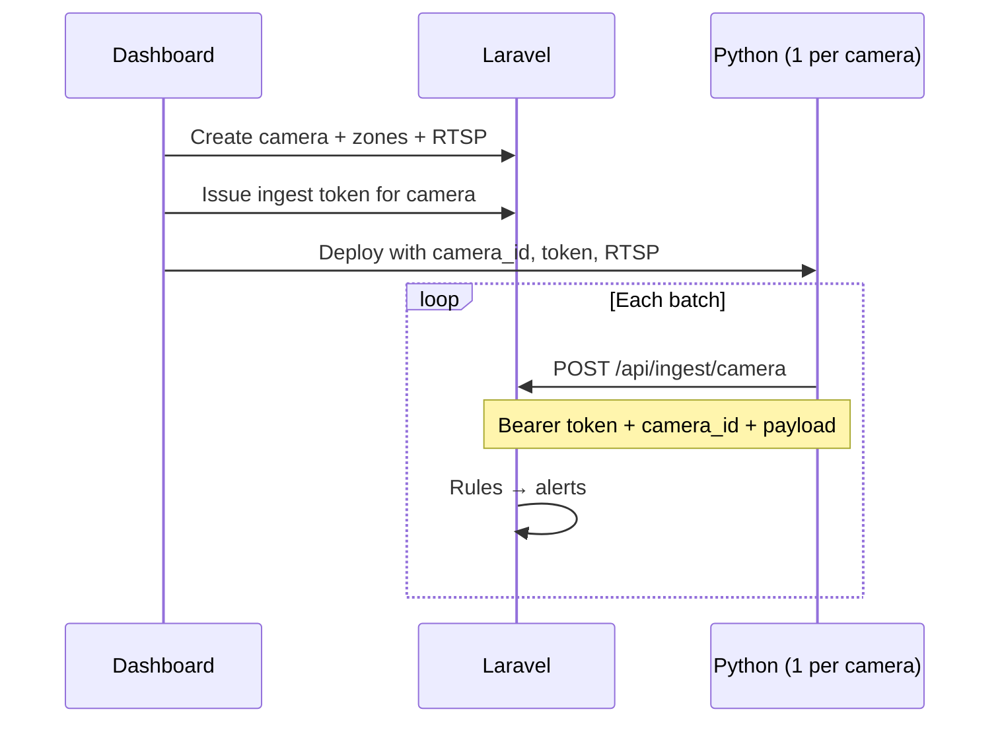

# 03 — Sites, Detection Modules & Cameras

[← Index](README.md) · **Linked:** [06 — AI ingestion API](06-ai-ingestion-api.md) · **Next:** [10 Users & RBAC](10-users-roles-permissions.md)

Replaces the earlier SaaS “organization” model. SiteGuard is **one installation** serving **many sites**. **Sites, locations, module toggles, and cameras are fully dynamic** — created and updated in the dashboard (or via integration API), not hardcoded in Python.

**Python never registers cameras.** Operators create cameras here first; each camera gets an **ingest token**. Python **POSTs** `camera_id` + `payload` to the single ingest endpoint — [06](06-ai-ingestion-api.md).

---

## 1. Deployment model

| Concept | Behavior |
|---------|----------|
| **Single project** | One Laravel app, one **MySQL** database |
| **Many sites** | Created by admins — North Tower, Highway Yard, etc. |
| **Dynamic topology** | User adds site → enables modules → defines locations → adds cameras per module + location |
| **Not SaaS** | No `organization_id`; no external self-signup |
| **Integrations** | REST provisioning + webhooks for external CMMS / VMS |

```text
┌──────────────────────────────────────────────────────────────┐
│  SiteGuard (single Laravel install)                           │
│  Site A                                                       │
│    ├── Locations: Gate · Yard · Level 2                       │
│    ├── Modules: [PPE ✓] [Vehicle ✓] [Height ✗]                  │
│    └── Cameras: each → one module + one location + settings   │
└──────────────────────────────────────────────────────────────┘
```

---

## 2. Dynamic site lifecycle

### 2.1 Create site (wizard)

**Permission:** `sites.create`

| Step | User action | System |
|------|-------------|--------|
| 1 | Name, code, timezone, address | `sites` row |
| 2 | Optional map pin | `map_center_lat/lng` |
| 3 | Add **locations** (tree or flat) | `site_locations` |
| 4 | Enable **detection modules** | `site_detection_modules` |
| 5 | Add **cameras** per module + location | `cameras` — each row gets a **`camera_id` (UUID)** used by Python |
| 6 | Zones/rules on each camera | `zones`, `zone_rules` |
| 7 | Issue **ingest token** (per camera) | `ingest_api_tokens.camera_id` — [06 §2](06-ai-ingestion-api.md#2-token-one-per-camera) |
| 8 | Deploy Python for that camera | Env: `camera_id`, token, RTSP (from dashboard) → `POST /api/ingest/camera` |

Sites can be created **empty** and filled later — no minimum cameras at create time.

### 2.2 Update site

**Permission:** `sites.update`

- Metadata, shifts, blackout dates, map  
- Archive: `status = archived` — cameras inactive, historical data retained  

### 2.3 Site-level settings (`sites.settings` JSON)

Extensible key-value for integrations and UI — not only columns:

| Key | Example |
|-----|---------|
| `external_ref` | CMMS project id |
| `client_name` | Display on reports |
| `commissioning_status` | `draft` \| `live` |
| `custom_fields` | `{ "contract": "CT-2026-01" }` |

---

## 3. Site locations (dynamic)

**Purpose:** Group cameras by **physical place** on site — gate, yard, floor, scaffold bay — independent of detection module.

### 3.1 `site_locations`

| Field | Purpose |
|-------|---------|
| `site_id` | FK |
| `parent_id` | O — nested tree (Site → Building → Floor → Zone) |
| `name` | “Gate 3”, “Loading bay B” |
| `code` | Short id for APIs |
| `sort_order` | Map/list order |
| `map_pin_lat/lng` | O — pin on site map |
| `settings` | JSON — floor level, height band tag, notes |

### 3.2 Camera ↔ location

Each `camera` has optional `site_location_id`:

```text
Site: North Tower
  Location: Gate 3
    Camera: gate-3-ppe-front     → module: PPE
    Camera: gate-3-vehicle-wide  → module: vehicle_proximity
  Location: Level 2 scaffold
    Camera: scaffold-height-side → module: working_at_height
```

**Same location, multiple modules:** Two cameras (or more) at one gate — each links to **one** detection module.

---

## 4. Detection modules (catalog + per-site config)

### 4.1 Module catalog (seeded product types)

`detection_modules` — **read-only catalog** of what Python can run (not created by end users):

| `key` | Name |
|-------|------|
| `ppe` | PPE compliance |
| `vehicle_proximity` | Vehicle & pedestrian |
| `working_at_height` | Work at height |

New module types in future = migration + Python worker — not dashboard CRUD.

### 4.2 Per-site module configuration (dynamic)

`site_detection_modules` — operator enables and tunes each module **per site**:

| Field | Purpose |
|-------|---------|
| `site_id` | FK |
| `detection_module_id` | FK |
| `is_enabled` | Off = no ingest, no alerts for this module on site |
| `settings` | JSON — thresholds, dwell, cooldown (sliders in UI) |
| `python_service_label` | O — optional label in dashboard only |

**Example:** Site enables PPE + height; vehicle added later when yard cameras are commissioned.

**Copy settings:** Admin copies `site_detection_modules.settings` from Site A → Site B.

---

## 5. Cameras (fully dynamic)

### 5.1 Create / update camera

**Permissions:** `cameras.create`, `cameras.update`

| Field | Purpose |
|-------|---------|
| `site_id` | R |
| `detection_module_id` | R — **which module** this stream feeds |
| `site_location_id` | O — **where** on site |
| `name` | Display |
| `code` | Unique per site — Python config |
| `viewing_angle` | `front` \| `side` \| `overhead` \| `other` |
| `rtsp_url` | Encrypted |
| `reference_frame_path` | Zone editor background |
| `sort_order` | List order |
| `is_active` | Soft disable |
| `settings` | JSON — per-camera overrides (see below) |
| `external_id` | O — VMS / CMMS camera id for sync |

**`camera_id` lifecycle:** Assigned by Laravel on create. Shown on camera detail with **ingest token** (copy to Python env). Every ingest POST includes this `camera_id` — [06 §3](06-ai-ingestion-api.md#3-request-body-minimal).

### 5.2 Per-camera `settings` JSON (examples)

| Key | Module | Purpose |
|-----|--------|---------|
| `confidence_min` | all | Override site default |
| `roi_crop` | all | Normalized crop before inference |
| `notes` | all | “Glare at sunset” |
| `elevation_m` | height | Height band hint |
| `paired_camera_code` | vehicle | Link wide + telephoto |

### 5.3 Flows

- **A:** User adds location “Gate 3” → adds PPE camera → assigns location → uploads reference frame → draws zones  
- **B:** Same location → adds second camera for `vehicle_proximity`  
- **C:** Move camera to new location — update `site_location_id` only; zones stay on camera  
- **D:** Duplicate camera — copy zones optional checkbox  
- **E:** Integration POST creates camera with `external_id` — idempotent upsert  

### 5.4 Many cameras per module

| Scenario | Cameras |
|----------|---------|
| PPE large site | Gate (front), scaffold L2 (side), plant (wide) |
| Vehicle | Yard overview + blind corner |
| Height | Ground up + platform along edge |

**Recommended:** one Python process per camera (`CAMERA_ID` + token + RTSP in env). Laravel is authoritative for **which** `camera_id` values exist — [§7](#7-python-ingest-link-laravel--python-contract).

### 5.5 Camera ↔ zone ↔ rules

```text
Site
  └── Location: Gate 3
        ├── Camera (PPE): gate-3-ppe
        │     └── Zones + rules
        └── Camera (Vehicle): gate-3-veh
              └── Zones + rules
```

Rules attach to **zones** on a **camera**; rule codes (e.g. `PPE-001`) reusable per site.

---

## 6. Integration & provisioning API

**Permission:** `integrations.manage` (or service account with scoped token)

### 6.1 REST endpoints (sketch)

| Method | Path | Purpose |
|--------|------|---------|
| POST | `/api/integration/sites` | Upsert site by `external_ref` |
| PUT | `/api/integration/sites/{id}/locations` | Bulk sync location tree |
| POST | `/api/integration/sites/{id}/cameras` | Upsert camera by `external_id` |
| PATCH | `/api/integration/cameras/{id}` | Update RTSP, location, module, settings |
| GET | `/api/integration/sites/{id}/export` | Full site config snapshot for DR |

Auth: Sanctum **integration token** (separate from Python ingest tokens).

### 6.2 Webhooks (outbound)

| Event | Payload |
|-------|---------|
| `site.created` | site id, name, code |
| `site.updated` | changed fields |
| `camera.created` | camera id, site_id, module, location_id |
| `camera.updated` | rtsp changed (masked), is_active |
| `module.enabled` | site_id, module key |

Subscribers configure URL + secret in **Settings → Integrations**.

### 6.3 Bulk import

CSV columns: `site_code`, `location_code`, `module_key`, `camera_code`, `name`, `rtsp_url`, `viewing_angle`  
→ `ImportCamerasJob` validates module enabled on site, creates locations if missing.

---

## 7. Python ingest link (Laravel ↔ Python contract)

Full spec: **[06 — AI ingestion API](06-ai-ingestion-api.md)** — **one POST** per camera.

### 7.1 Responsibility split

| Layer | Owns |
|-------|------|
| **Laravel** | Site, location, module, camera, zones, rules, RTSP, **ingest token per camera**, events, alerts, media |
| **Python** | Read RTSP (URL from deploy config), run model, `POST { camera_id, payload }` |

### 7.2 End-to-end sequence



### 7.3 Request shape (only ingest call)

```http
POST /api/ingest/camera
Authorization: Bearer {token_for_this_camera}
```

```json
{
  "camera_id": "<uuid from Laravel>",
  "payload": {
    "event_id": "<uuid>",
    "captured_at": "2026-05-17T14:32:00.120Z",
    "snapshot": "<base64 JPEG>",
    "detections": [
      { "classes": [{ "key": "no_helmet", "confidence": 0.91 }], "bbox": { "x": 0.42, "y": 0.18, "w": 0.12, "h": 0.28 } }
    ]
  }
}
```

Laravel loads site, module, zones, and rules from **`camera_id`**; maps zones from `bbox`; stores **`snapshot`** as alert evidence — [06 §3](06-ai-ingestion-api.md#3-request-body-minimal).

### 7.4 Commissioning checklist

1. Create camera in dashboard (module + location + RTSP).  
2. Copy **camera_id**, **ingest token**, **RTSP** to Python env.  
3. POST test payload with one detection.  
4. Confirm alert or event in dashboard.

### 7.5 Operational notes

| Dashboard change | Python action |
|------------------|---------------|
| Token rotated | Update env; old token → 401 |
| RTSP changed | Update `SITEGUARD_RTSP_URL`; restart worker |
| Camera deactivated | Stop POSTing; Laravel returns `CAMERA_NOT_FOUND` |
| Zones/rules changed | No API change — Laravel applies new rules on next POST |

---

## 8. Personas

| Persona | Needs |
|---------|--------|
| **HSE director** | Dynamic role with `sites.access_all` or many sites assigned |
| **Site supervisor** | One site — add cameras, locations, zones |
| **IT / deploy** | Integration API, ingest tokens, RTSP test |
| **Python engineer** | [06](06-ai-ingestion-api.md) — one POST per camera; token + `camera_id` + `payload` |

Workers on site are **not** application users.

---

## 9. Access control (summary)

- **One fixed role:** `super_admin` — all permissions, all sites — [10](10-users-roles-permissions.md)  
- **Dynamic roles:** Permission sets defined in UI  
- **Site scope:** `site_user` pivot or `sites.access_all` on role  

---

[← Index](README.md) · [06 AI ingestion API](06-ai-ingestion-api.md) · **Next:** [10 — Users, roles & permissions](10-users-roles-permissions.md)
