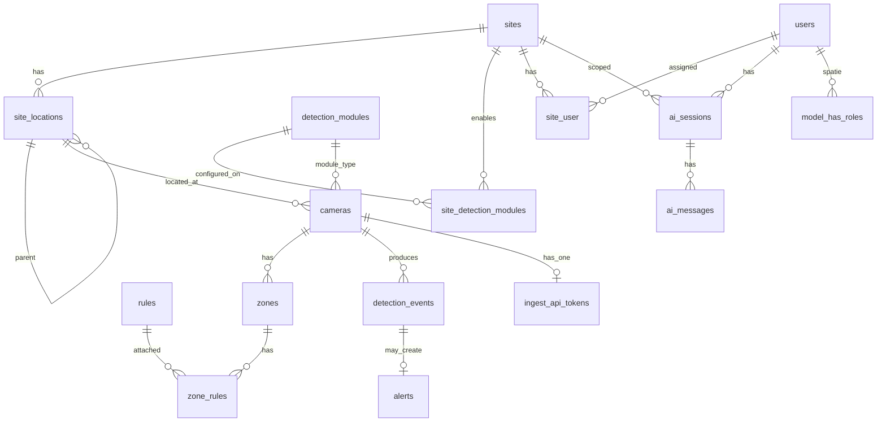

# 07 — Data Model & APIs

[← Index](README.md) · **Next:** [08 Product modules](08-product-modules.md)

**Stack:** Laravel 11 · Eloquent · **MySQL 8+** · Spatie Permission · [`laravel/ai`](https://laravel.com/docs/ai-sdk)  
Ingestion: [06](06-ai-ingestion-api.md) · RBAC: [10](10-users-roles-permissions.md)

---

## Table of contents

1. [Conventions](#1-conventions)
2. [Entity overview](#2-entity-overview)
3. [Users, auth & ingest tokens](#3-users-auth--ingest-tokens)
4. [Sites, modules & cameras](#4-sites-modules--cameras)
5. [Camera health from ingest](#5-camera-health-from-ingest-post)
6. [Zones & rules](#6-zones--rules)
7. [Detections & alerts](#7-detections--alerts)
8. [Media & investigations](#8-media--investigations)
9. [Notifications & settings](#9-notifications--settings)
10. [AI assistant data](#10-ai-assistant-data)
11. [Dashboard routes (Inertia)](#11-dashboard-routes-inertia)
12. [Appendices](#appendices)

---

## 1. Conventions

| Symbol | Meaning |
|--------|---------|
| **R** | Required on create |
| **O** | Optional |
| **RO** | Read-only (server) |

**Scoping:** Site-scoped tables include `site_id`. **No `organization_id`** — single installation.

**IDs:** `bigint` PK or `uuid` — pick one in implementation; docs use `id` generically.

**Timestamps:** `datetime` (UTC in app layer); display in `sites.timezone`. Use MySQL-compatible types (`json`, `decimal`, `char(36)` for UUIDs if used).

**Spatie tables:** `roles`, `permissions`, `model_has_roles`, `model_has_permissions`, `role_has_permissions` — standard package schema.

**RBAC:** One **fixed** system role `super_admin` (`roles.is_system = true`); all other roles and permission assignments are **dynamic** — [10](10-users-roles-permissions.md).

**Site topology:** Sites, locations, module enablement, and cameras are **fully dynamic** (dashboard + integration API) — [03](03-sites-modules-cameras.md).

---

## 2. Entity overview



---

## 3. Users, auth & ingest tokens

### 3.1 `users`

| Column | Type | R/O | Notes |
|--------|------|-----|-------|
| `name` | `string` | R | |
| `email` | `string` | R | Unique |
| `password` | `string` | R | Hashed |
| `is_active` | `bool` | R | Default true |
| `email_verified_at` | `datetime` | O | |
| `last_login_at` | `datetime` | O | |

Roles via Spatie — **not** a `role` enum column.  
Sites via `site_user` pivot — see [10](10-users-roles-permissions.md).

### 3.2 `roles` (Spatie + extensions)

| Column | Type | Notes |
|--------|------|-------|
| `name` | `string` | Unique; `super_admin` is system role |
| `guard_name` | `string` | `web` |
| `is_system` | `bool` | `true` only for `super_admin` — no delete, full permissions |
| `description` | `text` | O — admin UI |

**Rule:** Only `super_admin` has `is_system = true`. Dynamic roles created via `roles.manage`.

### 3.3 `permissions`

Seeded catalog — not user-created. New permissions added in migrations; `super_admin` auto-syncs all.

### 3.4 `site_user`

| Column | Type | R/O | Notes |
|--------|------|-----|-------|
| `user_id` | FK | R | |
| `site_id` | FK | R | |
| `is_primary` | `bool` | O | Default site in UI |

### 3.5 `ingest_api_tokens` *(Python — one per camera)*

| Column | Type | R/O | Notes |
|--------|------|-----|-------|
| `camera_id` | FK | R | **Only** camera this token may POST for |
| `name` | `string` | O | e.g. "Gate 3 PPE" |
| `token_hash` | `string` | R | SHA-256 of bearer secret |
| `token_prefix` | `string` | RO | First 8 chars for UI |
| `created_by_user_id` | FK | O | |
| `expires_at` | `datetime` | O | |
| `revoked_at` | `datetime` | O | |
| `last_used_at` | `datetime` | O | |

**Rule:** `POST /api/ingest/camera` body `camera_id` must match `ingest_api_tokens.camera_id`. Site and module are resolved from the camera row — [06](06-ai-ingestion-api.md).

**Unique:** one active token per camera (or allow rotate with revoke of previous).

---

## 4. Sites, modules & cameras

### 4.1 `settings` *(global, single row or key-value)*

| Key | Example | Notes |
|-----|---------|-------|
| `retention_days` | `90` | Snapshot retention |
| `default_confidence_min` | `0.75` | |
| `mail_from_address` | | Alerts email |
| `ai_enabled` | `true` | Global assistant kill switch (before calling agent) |
| `ai_max_messages_per_hour_user` | `60` | Rate limit |

Default LLM provider/model: **`config/ai.php`** (Laravel AI SDK), not this table.

### 4.2 `sites`

| Column | Type | R/O | Notes |
|--------|------|-----|-------|
| `name` | `string` | R | |
| `code` | `string` | O | Unique short code |
| `timezone` | `string` | R | IANA |
| `address` | `text` | O | |
| `status` | `enum` | R | `active` \| `archived` |
| `map_center_lat` | `decimal` | O | |
| `map_center_lng` | `decimal` | O | |
| `settings` | `json` | O | `external_ref`, `commissioning_status`, custom fields |
| `external_ref` | `string` | O | Unique — integration upsert key |

### 4.3 `site_locations`

| Column | Type | R/O | Notes |
|--------|------|-----|-------|
| `site_id` | FK | R | |
| `parent_id` | FK | O | Self-referential tree |
| `name` | `string` | R | |
| `code` | `string` | O | Unique per site |
| `sort_order` | `int` | O | |
| `map_pin_lat` | `decimal` | O | |
| `map_pin_lng` | `decimal` | O | |
| `settings` | `json` | O | `height_band`, notes |
| `external_ref` | `string` | O | Integration sync |

**Index:** `(site_id, code)` unique where code not null.

### 4.4 `detection_modules` *(catalog, seeded)*

| Column | Type | R/O | Notes |
|--------|------|-----|-------|
| `key` | `string` | R | `ppe`, `vehicle_proximity`, `working_at_height` |
| `name` | `string` | R | Display |
| `description` | `text` | O | |

### 4.5 `site_detection_modules`

| Column | Type | R/O | Notes |
|--------|------|-----|-------|
| `site_id` | FK | R | |
| `detection_module_id` | FK | R | |
| `is_enabled` | `bool` | R | |
| `settings` | `json` | O | Thresholds, dwell, cooldown overrides |

**Unique:** `(site_id, detection_module_id)`.

### 4.6 `cameras`

| Column | Type | R/O | Notes |
|--------|------|-----|-------|
| `site_id` | FK | R | |
| `detection_module_id` | FK | R | **One module per camera** |
| `site_location_id` | FK | O | Physical location on site |
| `name` | `string` | R | |
| `code` | `string` | O | Unique per site — for Python |
| `location_label` | `string` | O | Denormalized display; sync from `site_locations.name` optional |
| `viewing_angle` | `enum` | O | `front`, `side`, `overhead`, `other` |
| `rtsp_url` | `text` | O | Encrypted cast |
| `reference_frame_path` | `string` | O | For zone editor |
| `settings` | `json` | O | Per-camera overrides — ROI, confidence, notes |
| `sort_order` | `int` | O | |
| `is_active` | `bool` | R | |
| `external_id` | `string` | O | VMS/CMMS id — integration upsert |
| `last_ingest_at` | `datetime` | RO | Updated on each successful ingest POST |
| `health_status` | `enum` | RO | `online`, `degraded`, `offline` |

**Index:** `(site_id, detection_module_id)`, `(site_id, code)`, `(site_id, external_id)`.

### 4.7 `shifts`

| Column | Type | R/O | Notes |
|--------|------|-----|-------|
| `site_id` | FK | R | |
| `name` | `string` | R | |
| `start_time` | `time` | R | Local |
| `end_time` | `time` | R | |
| `days_of_week` | `json` | R | `[1,2,3,4,5]` |

---

## 5. Camera health (from ingest POST)

No separate heartbeat API. Each successful [06](06-ai-ingestion-api.md) POST updates:

| Column on `cameras` | Source |
|---------------------|--------|
| `last_ingest_at` | Request time |
| `health_status` | `online` on success; `offline` if no POST within threshold (e.g. 2 min) |

Snapshot stored from `payload.snapshot` → `media_objects` linked to `detection_events`.

---

## 6. Zones & rules

### 6.1 `zones`

| Column | Type | R/O | Notes |
|--------|------|-----|-------|
| `camera_id` | FK | R | |
| `site_id` | FK | R | Denormalized |
| `name` | `string` | R | |
| `polygon` | `json` | R | Normalized coordinates |
| `zone_type` | `string` | O | Module-specific tag |
| `is_active` | `bool` | R | |

### 6.2 `rules`

| Column | Type | R/O | Notes |
|--------|------|-----|-------|
| `site_id` | FK | R | |
| `detection_module_id` | FK | R | Rule belongs to module |
| `code` | `string` | R | `PPE-001` — unique per site |
| `name` | `string` | R | |
| `severity` | `enum` | R | `low` … `critical` |
| `definition` | `json` | R | DSL — [02](02-detection-capabilities.md) |
| `dwell_sec` | `int` | O | |
| `cooldown_sec` | `int` | O | |
| `is_active` | `bool` | R | |

### 6.3 `zone_rules`

| Column | Type | R/O | Notes |
|--------|------|-----|-------|
| `zone_id` | FK | R | |
| `rule_id` | FK | R | |

---

## 7. Detections & alerts

### 7.1 `detection_events`

| Column | Type | R/O | Notes |
|--------|------|-----|-------|
| `site_id` | FK | R | |
| `camera_id` | FK | R | |
| `detection_module_id` | FK | R | Denormalized from camera |
| `ingest_event_id` | `uuid` | R | From `payload.event_id` — idempotency for whole POST |
| `event_id` | `uuid` | R | Per detection row — `{ingest_event_id}-{index}` or separate UUID |
| `captured_at` | `datetime` | R | |
| `received_at` | `datetime` | RO | |
| `classes` | `json` | R | |
| `bbox` | `json` | R | |
| `track_id` | `string` | O | Not in minimal ingest — reserved for future |
| `zone_ids` | `json` | RO | Server computes from `bbox` + camera zones |
| `model_name` | `string` | RO | From camera/site settings default |
| `model_version` | `string` | RO | From camera/site settings default |
| `extras` | `json` | O | e.g. `distance_m` when vehicle module |
| `snapshot_media_id` | FK | R | From `payload.snapshot` on ingest |
| `clip_media_id` | FK | O | |

**Unique:** `(ingest_event_id)` for idempotent POST; per-row `event_id` unique.

### 7.2 `alerts`

| Column | Type | R/O | Notes |
|--------|------|-----|-------|
| `site_id` | FK | R | |
| `camera_id` | FK | O | |
| `detection_module_id` | FK | R | |
| `rule_id` | FK | R | |
| `severity` | `enum` | R | |
| `status` | `enum` | R | `open`, `acknowledged`, `dismissed`, `resolved` |
| `title` | `string` | RO | |
| `first_detection_event_id` | FK | R | |
| `last_detection_event_id` | FK | O | |
| `occurrence_count` | `int` | RO | |
| `opened_at` | `datetime` | RO | |
| `closed_at` | `datetime` | O | |
| `assigned_user_id` | FK | O | |

### 7.3 `alert_actions`

| Column | Type | R/O | Notes |
|--------|------|-----|-------|
| `alert_id` | FK | R | |
| `user_id` | FK | O | |
| `action` | `enum` | R | `acknowledge`, `dismiss`, `false_positive`, `resolve`, `comment` |
| `reason_code` | `string` | O | |
| `note` | `text` | O | |

---

## 8. Media & investigations

### 8.1 `media_objects`

| Column | Type | R/O | Notes |
|--------|------|-----|-------|
| `site_id` | FK | R | |
| `camera_id` | FK | O | |
| `storage_key` | `string` | R | |
| `media_type` | `enum` | R | `snapshot`, `clip` |
| `content_type` | `string` | R | |
| `captured_at` | `datetime` | R | |

### 8.2 `investigations` / `investigation_alerts`

Same as prior spec — site-scoped, linked to alerts.

---

## 9. Notifications & settings

### 9.1 `notification_channels`

| Column | Type | R/O | Notes |
|--------|------|-----|-------|
| `site_id` | FK | O | Null = global |
| `type` | `enum` | R | `email`, `webhook`, `slack` |
| `config` | `json` | R | Encrypted |
| `min_severity` | `enum` | R | |

---

## 10. AI assistant data

**LLM runtime:** [Laravel AI SDK](https://laravel.com/docs/ai-sdk) (`laravel/ai`) — agent `SiteSafetyAgent`, tools in `app/Ai/Tools/`. Provider keys in `config/ai.php` / `.env` (`OPENAI_API_KEY`, etc.).

**SiteGuard tables** (site-scoped threads + audit; separate from SDK optional `agent_conversations`):

### 10.1 `ai_sessions`

| Column | Type | R/O | Notes |
|--------|------|-----|-------|
| `site_id` | FK | R | |
| `user_id` | FK | R | |
| `title` | `string` | O | Auto from first message |
| `last_message_at` | `datetime` | RO | |

### 10.2 `ai_messages`

| Column | Type | R/O | Notes |
|--------|------|-----|-------|
| `ai_session_id` | FK | R | |
| `role` | `enum` | R | `user`, `assistant`, `system` |
| `content` | `text` | O | |
| `audio_storage_key` | `string` | O | Optional voice upload |
| `proposed_actions` | `json` | O | Pending user confirm |
| `chart_spec` | `json` | O | For dashboard charts |
| `citations` | `json` | O | alert/event ids used |

### 10.3 `ai_audit_logs`

| Column | Type | R/O | Notes |
|--------|------|-----|-------|
| `ai_message_id` | FK | R | |
| `tool_name` | `string` | R | |
| `tool_input` | `json` | R | |
| `tool_output` | `json` | O | |
| `llm_model` | `string` | O | |
| `latency_ms` | `int` | O | |

Detail: [11 — AI Assistant](11-ai-assistant.md)

---

## 11. Dashboard routes (Inertia)

**Prefix:** `/` with `auth` middleware. Permissions via `can:` middleware — see [10](10-users-roles-permissions.md).

| Method | Path | Permission |
|--------|------|------------|
| GET | `/dashboard` | `alerts.view` |
| GET | `/sites` | `sites.view` |
| GET | `/sites/create` | `sites.create` |
| POST | `/sites` | `sites.create` |
| GET | `/sites/{site}/setup` | `sites.update` — wizard |
| PATCH | `/sites/{site}` | `sites.update` |
| GET | `/sites/{site}` | `sites.view` + site access |
| GET | `/sites/{site}/locations` | `locations.manage` |
| POST | `/sites/{site}/locations` | `locations.manage` |
| PATCH | `/sites/{site}/locations/{loc}` | `locations.manage` |
| DELETE | `/sites/{site}/locations/{loc}` | `locations.manage` |
| GET | `/sites/{site}/modules` | `modules.view` |
| PATCH | `/sites/{site}/modules/{module}` | `modules.configure` |
| GET | `/sites/{site}/modules/{module}/cameras` | `cameras.view` |
| POST | `/sites/{site}/modules/{module}/cameras` | `cameras.create` |
| PATCH | `/cameras/{camera}` | `cameras.update` |
| DELETE | `/cameras/{camera}` | `cameras.delete` |
| GET | `/roles` | `roles.view` |
| POST | `/roles` | `roles.manage` |
| PATCH | `/roles/{role}` | `roles.manage` |
| DELETE | `/roles/{role}` | `roles.manage` — not `is_system` |
| GET | `/cameras/{camera}/zones` | `zones.manage` |
| PUT | `/cameras/{camera}/zones` | `zones.manage` |
| GET | `/sites/{site}/alerts` | `alerts.view` |
| GET | `/alerts/{alert}` | `alerts.view` |
| POST | `/alerts/{alert}/acknowledge` | `alerts.acknowledge` |
| GET | `/users` | `users.view` |
| POST | `/users` | `users.manage` |
| POST | `/cameras/{camera}/ingest-token` | `api_tokens.manage` — issue/rotate |
| DELETE | `/cameras/{camera}/ingest-token` | `api_tokens.manage` — revoke |
| GET | `/sites/{site}/ai/sessions` | `ai.assistant.use` |
| POST | `/sites/{site}/ai/sessions` | `ai.assistant.use` |
| POST | `/sites/{site}/ai/sessions/{sid}/messages` | `ai.assistant.use` |
| POST | `/sites/{site}/ai/command` | `ai.assistant.use` |
| POST | `/sites/{site}/ai/actions/execute` | `ai.assistant.use` + action policy |

**Ingest route** in `routes/api.php` — **POST only** ([06](06-ai-ingestion-api.md)):

| Method | Path |
|--------|------|
| POST | `/api/ingest/camera` |

**Integration routes** (`routes/api.php`, Sanctum integration token):

| Method | Path | Permission / scope |
|--------|------|-------------------|
| POST | `/api/integration/sites` | `integrations.manage` |
| PUT | `/api/integration/sites/{site}/locations` | bulk locations |
| POST | `/api/integration/sites/{site}/cameras` | upsert by `external_id` |
| PATCH | `/api/integration/cameras/{camera}` | |
| GET | `/api/integration/sites/{site}/export` | full config snapshot |

---

## Appendices

### Appendix A — Glossary

| Term | Meaning |
|------|---------|
| **Detection module** | PPE, vehicle proximity, or working at height (catalog) |
| **Site location** | Physical place on site; cameras optional FK |
| **Camera** | One stream → one site + one module + optional location |
| **Ingest POST** | Single `POST /api/ingest/camera` per camera |
| **Ingest token** | One bearer token per camera — `POST /api/ingest/camera` only |
| **Ingest payload** | `event_id`, `captured_at`, `snapshot`, `detections[]` — [06 §3](06-ai-ingestion-api.md#3-request-body-minimal) |

### Appendix B — Eloquent relationships (sketch)

```php
class Site extends Model
{
    public function locations(): HasMany { … }
    public function detectionModules(): BelongsToMany { … }
}

class SiteLocation extends Model
{
    public function site(): BelongsTo { … }
    public function parent(): BelongsTo { … }
    public function cameras(): HasMany { … }
}

class Camera extends Model
{
    public function site(): BelongsTo { … }
    public function siteLocation(): BelongsTo { … }
    public function detectionModule(): BelongsTo { … }
    public function zones(): HasMany { … }
}
```

---

[← Index](README.md) · [06 Ingestion API](06-ai-ingestion-api.md) · [11 AI Assistant](11-ai-assistant.md) · [10 RBAC](10-users-roles-permissions.md)
